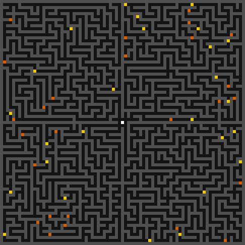
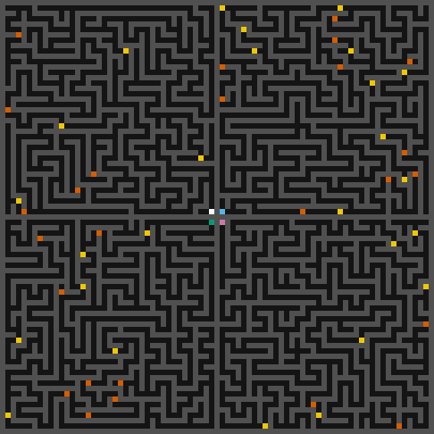
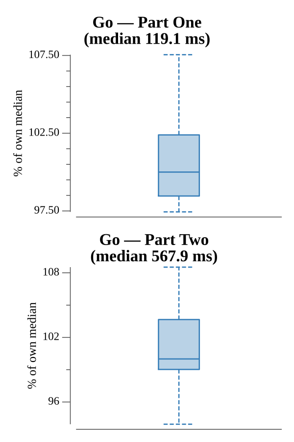

# [Day 18: Many-Worlds Interpretation](https://adventofcode.com/2019/day/18)

<!-- These are helper text to make formatting the yearly readme consistent and easier...

[Day 18: Many-Worlds Interpretation][rm18]
[Go][go18]

[rm18]: 18-many-WorldsInterpretation/README.md
[go18]: 18-many-WorldsInterpretation/go

-->

## Notes

The input is a 2-D tile maze containing walls (`#`), open passages (`.`), keys (`a`–`z`), locked doors (`A`–`Z`), and one robot (`@`). The goal is to collect every key in the fewest steps.

**Part One** uses a two-phase approach. First, a key-graph is precomputed: BFS from each key position (and the starting position) finds every other reachable key, recording the step distance and the bitmask of door-keys required along the shortest path. This reduces the problem to a much smaller graph. Second, Dijkstra is run on the state `(currentKey, keysMask)` — the robot's current location in the key graph and the set of keys collected so far — to find the minimum total distance needed to reach the all-keys state.

**Part Two** first applies the 3×3 center transformation: the single `@` and its four cardinal neighbors become walls, and the four diagonal neighbors become the four robot start positions. The same key-graph precomputation is extended to four separate start nodes. Dijkstra then runs on the state `([4]robot positions, keysMask)` — at each step exactly one robot moves to a reachable key — to find the globally optimal assignment of keys to robots.

## Go

```text
────────────────────────────────────────
─       2019 Day 18: Many-Worlds       ─
─            Interpretation            ─
────────────────────────────────────────

Solving (Go)…
1.0:  PASS           172.495ms
2.0:  PASS           782.086ms
```

## Visualization

The visualizations animate the optimal key-collection paths found by the solver.

**Part One** shows a single white robot navigating the maze, picking up keys one by one. Uncollected keys appear yellow; collected keys and their corresponding doors dim to gray as they are acquired. Locked doors appear orange-red until the required key is collected.

**Part Two** shows four robots (white, sky-blue, bluish-green, and reddish-purple) operating simultaneously in their four separate quadrants, coordinating to collect all keys with the minimum combined steps. Each robot's color remains distinct in grayscale, and the brightness contrast between walls (dark gray), open passages (near-black), robots (bright), and keys/doors (mid-tone) is preserved for colorblind viewers.





## Run Times


