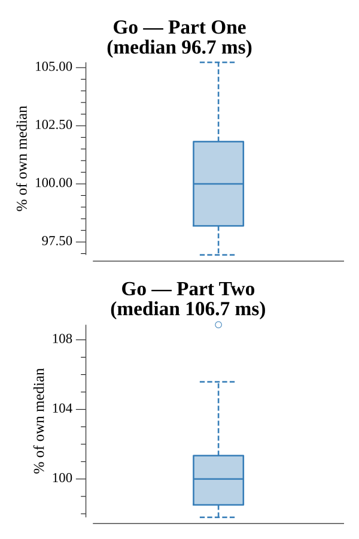

# [Day 19: Tractor Beam](https://adventofcode.com/2019/day/19)

<!-- These are helper text to make formatting the yearly readme consistent and easier...

[Day 19: Tractor Beam][rm19]
[Go][go19]

[rm19]: 19-tractorBeam/README.md
[go19]: 19-tractorBeam/go

-->

## Notes

The input is an Intcode program that, given an (x, y) coordinate, outputs 1 if that point is within the drone's tractor beam and 0 if it is not. Each query requires a fresh Intcode VM instance.

**Part One** queries all 2,500 points in the 50×50 grid (x and y from 0 to 49), running a separate Intcode VM for each point and counting the outputs of 1.

**Part Two** finds the first position where a 100×100 square fits entirely within the beam. The left edge of the beam at each row is tracked (it moves monotonically rightward as rows increase). For each row, the right edge is computed from the left edge. The check is whether the top-right corner of the candidate square — (x+99, y−99) — is still within the beam. The first row where this holds gives the top-left corner of the fitting square, and the answer is x×10000+y.

## Go

```text
────────────────────────────────────────
─      2019 Day 19: Tractor Beam       ─
────────────────────────────────────────

Solving (Go)…
1.0:  PASS           102.904ms
2.0:  PASS           104.978ms
```

## Run Times


