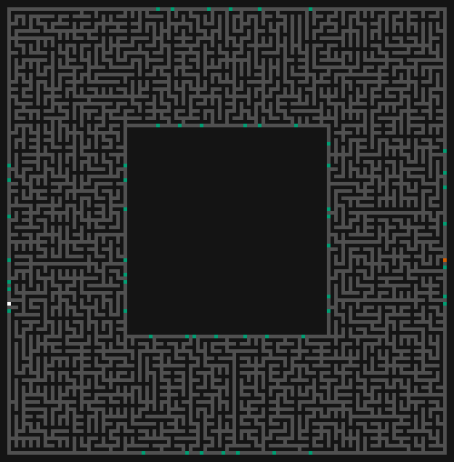
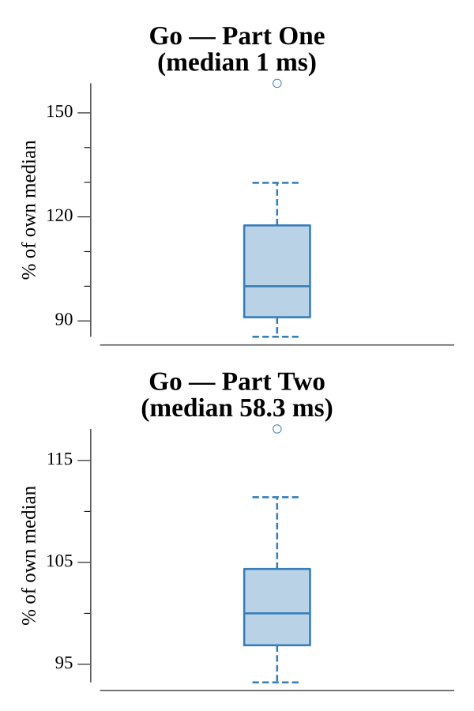

# [Day 20: Donut Maze](https://adventofcode.com/2019/day/20)

<!-- These are helper text to make formatting the yearly readme consistent and easier...

[Day 20: Donut Maze][rm20]
[Go][go20]

[rm20]: 20-donutMaze/README.md
[go20]: 20-donutMaze/go

-->

## Notes

The input is a donut-shaped ASCII maze. Portal labels are two-letter identifiers painted on tiles adjacent to open passages (`.`). Parsing scans all adjacent letter-pair clusters and associates each pair with the neighbouring `.` tile to build a portal map.

**Part One** treats the maze as a flat graph. Portal jumps are free shortcuts: stepping onto a portal tile teleports to its matching tile on the other side. BFS from `AA` to `ZZ` finds the shortest path.

**Part Two** adds a `level` dimension, making the maze recursive. Each `(position, level)` pair is a distinct state. Inner portals (those in the donut hole, away from the outer wall) go one level deeper (`level+1`); outer portals go one level shallower (`level-1`), but are blocked at `level 0`. `ZZ` is only reachable at `level 0`. BFS over `(pos, level)` states finds the shortest path through all levels.

## Go

```text
────────────────────────────────────────
─       2019 Day 20: Donut Maze        ─
────────────────────────────────────────

Testing (Go)…
1.0:  PASS             0.095ms
2.0:  PASS             2.914ms

Solving (Go)…
1.0:  PASS             1.015ms
2.0:  PASS            64.144ms
```

## Visualization



**Part One** animates the BFS path through the flat (non-recursive) maze step by step. Portal tiles are highlighted in teal; the AA start tile is sky-blue and ZZ end tile is vermillion. Cells already traversed appear as dim yellow breadcrumbs, and the current position is bright white. Portal jumps (teleports) are shown as keyframes so they are never skipped.


**Part Two** animates the recursive BFS path. The current position is colored by recursion depth: white at level 0, sky-blue at level 1, bluish-green at level 2, orange at level 3, vermillion at level 4, and purple at level 5 and beyond. Level-change steps are always included as keyframes. Breadcrumbs accumulate across the full path, showing which cells were visited at any depth.

In grayscale, brightness encodes meaning: open passages are near-black (~20), walls are dark gray (~80), portals and endpoints are mid-tone (~107–165), breadcrumbs are lighter (~151), and the current position is brightest (~255).

## Run Times


