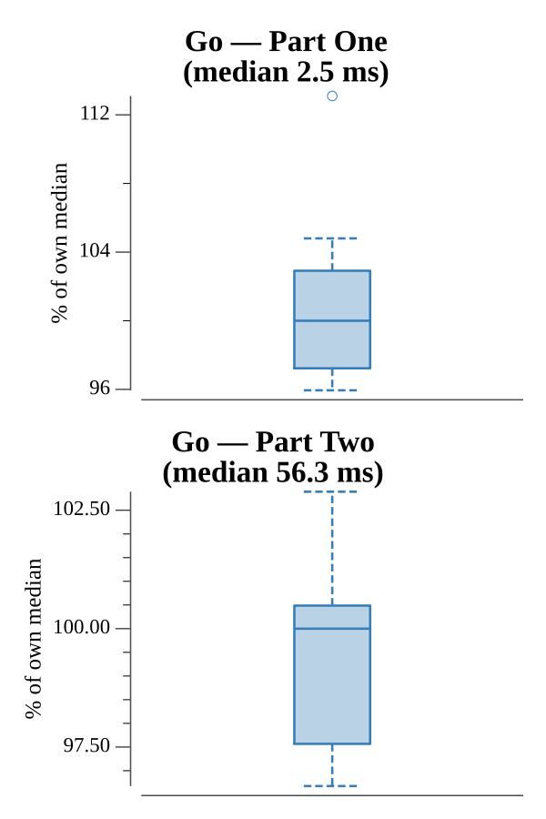

# [Day 21: Springdroid Adventure](https://adventofcode.com/2019/day/21)

<!-- These are helper text to make formatting the yearly readme consistent and easier...

[Day 21: Springdroid Adventure][rm21]
[Go][go21]

[rm21]: 21-springdroidAdventure/README.md
[go21]: 21-springdroidAdventure/go

-->

## Notes

The input is an Intcode program running a springdroid. You supply a springscript program as ASCII over the Intcode's input channel; the droid either falls into a hole (returning a small ASCII error code) or crosses successfully (returning a large integer — the hull damage reading).

Springscript has three instructions — `AND`, `OR`, `NOT` — operating on boolean registers. Readable registers are A–D (tiles 1–4 ahead) for Part One and A–I (tiles 1–9 ahead) for Part Two; T (temp) and J (jump) are writable. When J is true at the end of a step the droid jumps exactly 4 tiles.

**Part One** uses `WALK` mode (registers A–D). The droid should jump when it cannot safely walk forward — a hole at A, B, or C — and only when landing on D is solid:

```
J = (¬A ∨ ¬B ∨ ¬C) ∧ D
```

Implemented as:

```
NOT A J
NOT B T
OR  T J
NOT C T
OR  T J
AND D J
WALK
```

**Part Two** uses `RUN` mode (registers A–I). The same condition applies, but we must also confirm that after landing on D we can continue: either E is solid (walk one step) or H is solid (jump again safely from D, landing 4 tiles further):

```
J = (¬A ∨ ¬B ∨ ¬C) ∧ D ∧ (E ∨ H)
```

The `E OR H` term is computed by negating E twice (to get E back into T) then OR-ing H:

```
NOT A J
NOT B T
OR  T J
NOT C T
OR  T J
AND D J
NOT E T
NOT T T
OR  H T
AND T J
RUN
```

## Go

```text
────────────────────────────────────────
─  2019 Day 21: Springdroid Adventure  ─
────────────────────────────────────────

Solving (Go)…
1.0:  PASS             2.333ms
2.0:  PASS            52.045ms
```

## Run Times


