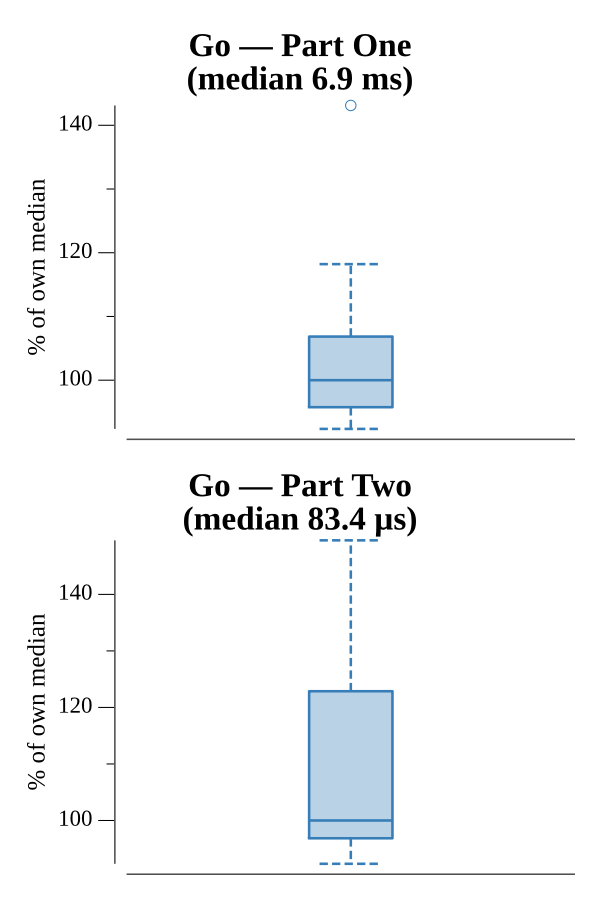

# [Day 22: Slam Shuffle](https://adventofcode.com/2019/day/22)

<!-- These are helper text to make formatting the yearly readme consistent and easier...

[Day 22: Slam Shuffle][rm22]
[Go][go22]

[rm22]: 22-slamShuffle/README.md
[go22]: 22-slamShuffle/go/exercise.go

-->

## Notes

The input is a sequence of shuffle operations applied to a large deck of space cards. Three operations are defined: **deal into new stack** (reversal), **cut N** (rotation), and **deal with increment N** (stride-permutation).

**Part One** — direct simulation on a 10007-card deck. Each operation is applied in order to track where card 2019 ends up. Representing the deck as a slice and applying each step literally is fast enough at this size.

**Part Two** — the deck has 119,315,717,514,047 cards and the shuffle is repeated 101,741,582,076,661 times, making simulation impossible. The key insight is that every shuffle operation is an *affine map* over Z/NZ: position → (a·pos + b) mod N. The three operations translate directly:

- Deal into new stack: a = −1, b = N−1
- Cut k: a = 1, b = −k
- Deal with increment k: a = k, b = 0

Composing two affine maps (a₁, b₁) ∘ (a₂, b₂) = (a₁·a₂, a₁·b₂ + b₁) mod N means the entire shuffle sequence collapses into a single (a, b) pair in one forward pass. Applying that map T times uses fast exponentiation (repeated squaring) to get (aᵀ, b·(aᵀ−1)·(a−1)⁻¹) mod N. The modular inverse of (a−1) is computed via Fermat's little theorem since N is prime: x⁻¹ ≡ x^(N−2) mod N. Finally, we want the *card at position 2020*, which requires inverting the composed map: card = (2020 − b) · a⁻¹ mod N.

## Go

```text
────────────────────────────────────────
─      2019 Day 22: Slam Shuffle       ─
────────────────────────────────────────

Solving (Go)…
1.0:  PASS             7.121ms
2.0:  PASS             0.083ms
```

## Run Times


