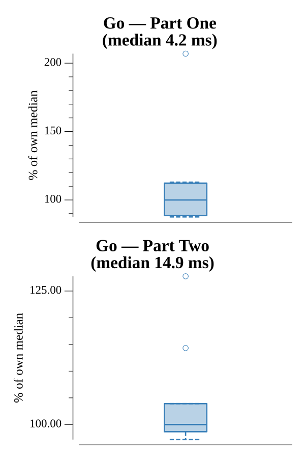

# [Day 23: Category Six](https://adventofcode.com/2019/day/23)

<!-- These are helper text to make formatting the yearly readme consistent and easier...

[Day 23: Category Six][rm23]
[Go][go23]

[rm23]: 23-categorySix/README.md
[go23]: 23-categorySix/go/exercise.go

-->

## Notes

The puzzle runs a network of 50 Intcode computers (NICs), each initialized with the puzzle program and its own address (0–49). NICs communicate by sending and receiving packets of the form `(destination, X, Y)`.

**Part One** — boot all 50 NICs and run the network until any NIC sends a packet to address 255 (the NAT). The answer is the Y value of that first packet.

**Part Two** — introduce a Network Address Translator (NAT) that stores the most recent packet sent to address 255. Idle detection is the key challenge: the network is considered idle when, in a full round of stepping all 50 NICs, no NIC produced any output *and* every NIC had an empty input queue (was blocked on −1). When idle, the NAT injects its stored packet to NIC 0 to restart the network. The answer is the Y value of the first NAT packet delivered to NIC 0 twice in a row — meaning the network re-idled with the same Y, indicating a steady state.

## Go

```text
────────────────────────────────────────
─      2019 Day 23: Category Six       ─
────────────────────────────────────────

Solving (Go)…
1.0:  PASS             5.012ms
2.0:  PASS            15.734ms
```

## Run Times


