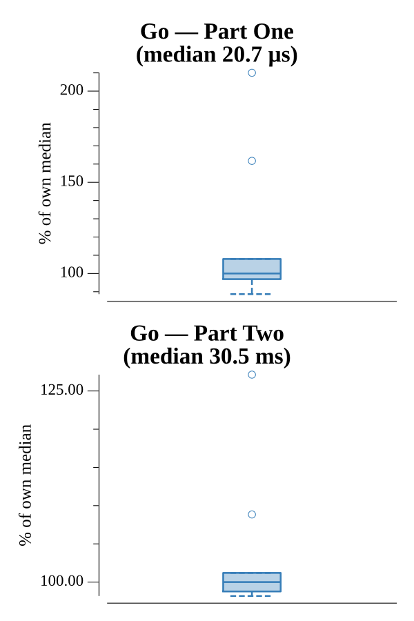

# [Day 24: Planet of Discord](https://adventofcode.com/2019/day/24)

<!-- These are helper text to make formatting the yearly readme consistent and easier...

[Day 24: Planet of Discord][rm24]
[Go][go24]
[Python][py24]

[rm24]: 24-planetOfDiscord/README.md
[go24]: 24-planetOfDiscord/go
[py24]: 24-planetOfDiscord/py

-->

## Notes

The puzzle simulates a 5×5 grid of bugs following Conway's Game of Life rules on a single planet, and then extends the idea to an infinite stack of recursively nested grids.

**Part One** — the grid is encoded as a `uint32` bitmask (bit `row*5+col` = 1 means bug). Each step applies the standard life rules: a bug survives with exactly 1 neighbor, an empty tile becomes a bug with 1 or 2 neighbors. The state space is tiny (25 bits), so a `map[uint32]bool` seen-set detects the first repeated layout in microseconds. The biodiversity rating is the bitmask value itself.

**Part Two** — the center tile (position 12) is replaced by a portal that leads to an inner level, while grid edges wrap to the corresponding edge tile of the outer level. The full recursive structure is stored as `map[int]uint32`, keyed by level (negative = outer, positive = inner). Each step computes neighbor counts per the Plutonian adjacency rules — crossing an outer edge reads one parent tile; crossing into the center reads an entire row or column of the child level. The simulation runs 200 steps (10 if the input contains `?`, which is the example marker). If the input contained `?`, it is treated as `.` for grid parsing.

## Go

```text
────────────────────────────────────────
─    2019 Day 24: Planet of Discord    ─
────────────────────────────────────────

Testing (Go)…
1.0:  PASS            48.534µs
2.0:  PASS           114.196µs

Solving (Go)…
1.0:  PASS             0.021ms
2.0:  PASS            29.877ms
```

## Run Times


