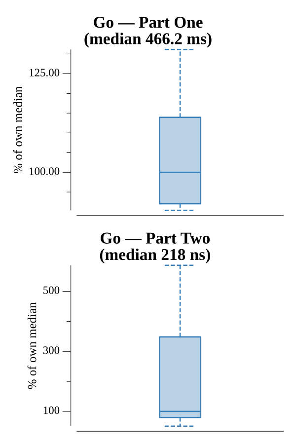

# [Day 25: Cryostasis](https://adventofcode.com/2019/day/25)

<!-- These are helper text to make formatting the yearly readme consistent and easier...

[Day 25: Cryostasis][rm25]
[Go][go25]
[Python][py25]

[rm25]: 25-cryostasis/README.md
[go25]: 25-cryostasis/go
[py25]: 25-cryostasis/py

-->

## Notes

The puzzle is an Intcode-powered text adventure. The solution drives the virtual droid autonomously in two phases.

**Phase 1 — Exploration:** A depth-first search walks every reachable room, recording the map and collecting all safe items along the way. Four items are blacklisted because picking them up kills or traps the droid: `giant electromagnet`, `escape pod`, `infinite loop`, `photons`, and `molten lava`. Every other item is collected immediately.

**Phase 2 — Security Checkpoint:** The droid navigates to the Security Checkpoint and tries all 2^8 = 256 subsets of the collected items, dropping or picking up items to match each candidate subset and then attempting to pass through the pressure-sensitive floor. The subset that produces the correct weight triggers the airlock, and Santa's crew reads the keypad value — the puzzle answer — from the Intcode output.

**Part Two** — Day 25 has no real Part Two. Collecting all fifty stars returns "Merry Christmas!".

## Go

```text
────────────────────────────────────────
─       2019 Day 25: Cryostasis        ─
────────────────────────────────────────

Solving (Go)…
1.0:  PASS           661.395ms
2.0:  NEW              0.000ms
```

## Run Times


