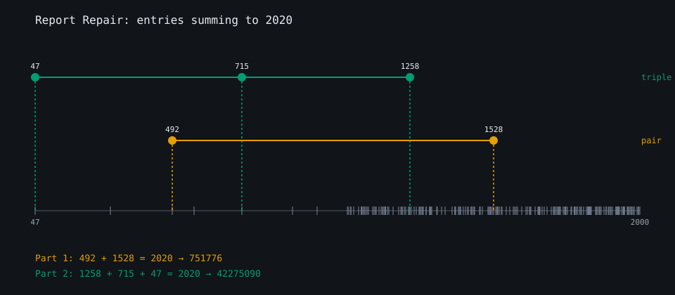
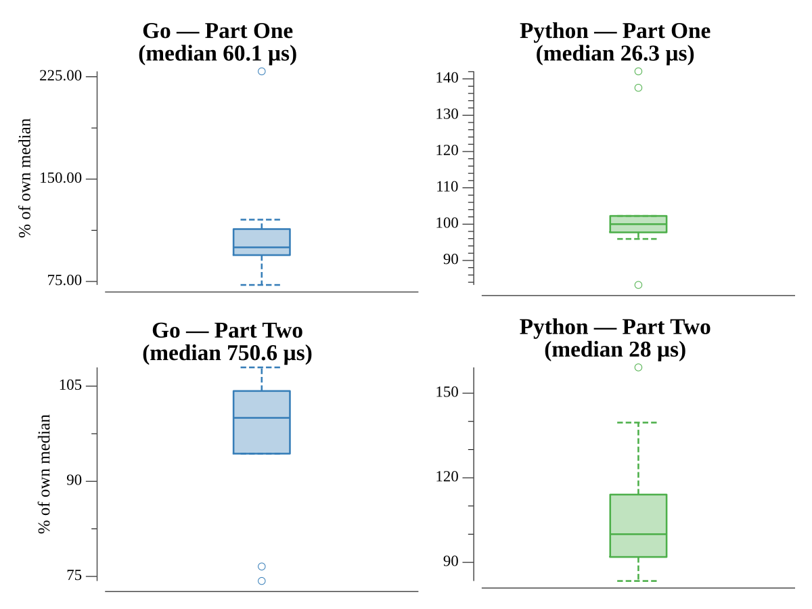

# [Day 1: Report Repair](https://adventofcode.com/2020/day/1)

<!-- [Day 1: Report Repair](01-reportRepair) -->

## Notes

Find the entries that sum to 2020 and return their product — two entries for
Part One, three for Part Two. Rather than nested scans, each part uses a
complement set: Part One is a single pass (for each `a`, was `2020 - a` seen?),
and Part Two fixes the first entry and runs that same two-sum over the remainder,
so the whole thing is O(n^2) with no wasted comparisons.

## Go

```text
────────────────────────────────────────
─      2020 Day 1: Report Repair       ─
────────────────────────────────────────

Solving (Go)…
1.0:  PASS            20.793µs
2.0:  PASS           350.980µs
```

## Python

```text
    < section intentionally left blank >
```

## Visualization

Every expense entry plotted on a shared value axis, with the two sets that sum to
2020 marked: the Part One pair and the Part Two triple, each in its own lane with
connectors down to the axis and a label giving the sum and product. Background
entries, pair, and triple use three colorblind-safe colors that also differ in
brightness, and the marked entries are drawn larger, so the highlights read in
grayscale as well as color.



## Run Times


