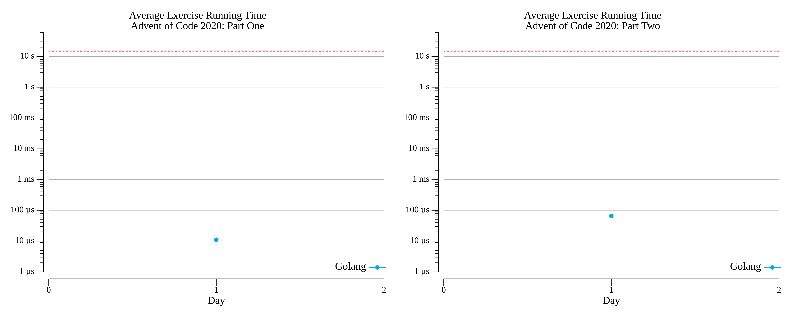

# [Day 1: Report Repair](https://adventofcode.com/2020/day/1)

<!-- [Day 1: Report Repair](01-reportRepair) -->

## Go

```text
2020-1 Report Repair (Golang)

Running...

Test 1.0: pass in 1.8 µs
Test 2.0: pass in 2.4 µs
Part 1: 751776 in 9.6 µs
Part 2: 42275090 in 62.2 µs
```

## Python

```text
    < section intentionally left blank >
```

## 2020 Run Times


