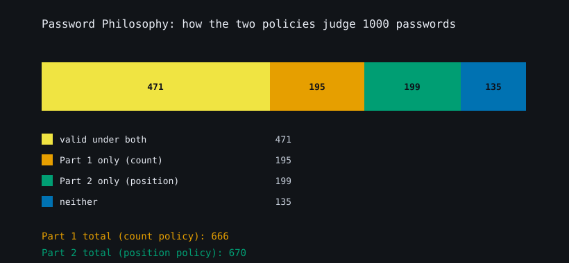
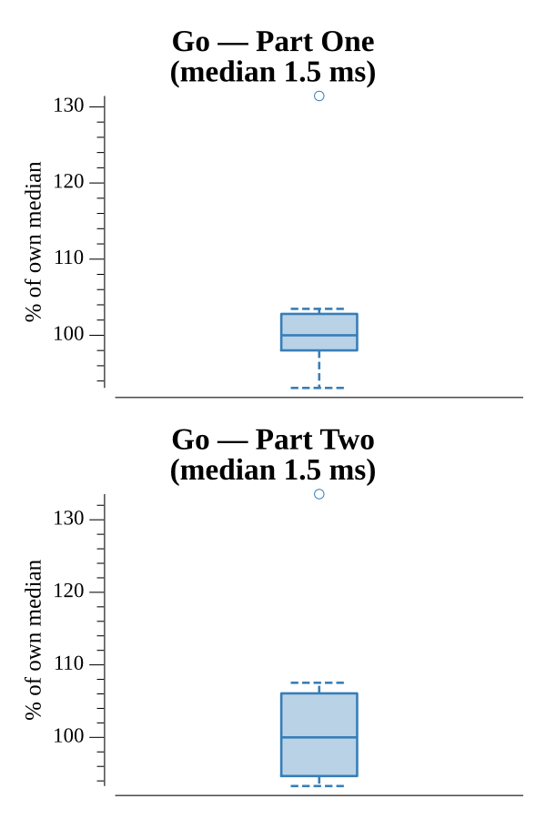

# [Day 2: Password Philosophy](https://adventofcode.com/2020/day/2)

<!-- These are helper text to make formatting the yearly readme consistent and easier...

[Day 2: Password Philosophy][rm2]
[Go][go2]

[rm2]: 02-passwordPhilosophy/README.md
[go2]: 02-passwordPhilosophy/go

-->

## Notes

Each line is a policy `lo-hi c: password`. The two parts read the same `lo`/`hi`
numbers differently:

- **Part One** treats them as a count range: the password is valid if `c` appears
  between `lo` and `hi` times.
- **Part Two** treats them as two 1-based positions: valid if exactly one of those
  positions holds `c` (an exclusive-or).

Both are a single linear pass over the entries.

## Go

```text
────────────────────────────────────────
─   2020 Day 2: Password Philosophy    ─
────────────────────────────────────────

Solving (Go)…
1.0:  PASS             1.378ms
2.0:  PASS             1.329ms
```

## Visualization

The 1000 passwords broken down by how the two policies judge each one: valid
under both, the count policy only, the position policy only, or neither. The
stacked bar and table show that the two rules mostly disagree about which
passwords pass — only 471 satisfy both — even though their totals (666 and 670)
are close. The four groups use colorblind-safe colors ordered by brightness and
every segment is labeled, so the chart reads in grayscale.



## Run Times


