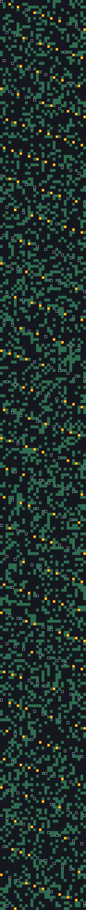
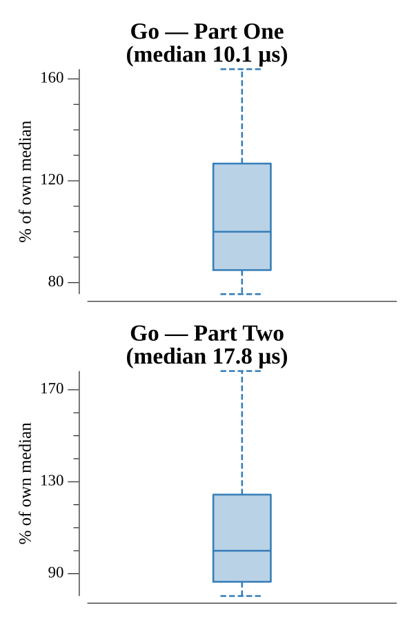

# [Day 3: Toboggan Trajectory](https://adventofcode.com/2020/day/3)

<!-- These are helper text to make formatting the yearly readme consistent and easier...

[Day 3: Toboggan Trajectory][rm3]
[Go][go3]

[rm3]: 03-tobogganTrajectory/README.md
[go3]: 03-tobogganTrajectory/go

-->

## Notes

The map is a grid of open squares and trees that repeats infinitely to the right,
so a run down a slope wraps its column with a modulo of the map width. A single
helper walks any `(right, down)` slope from the top-left and counts the trees hit.
Part One uses the right-3, down-1 slope; Part Two multiplies the tree counts over
five slopes: (1,1), (3,1), (5,1), (7,1), (1,2).

## Go

```text
────────────────────────────────────────
─   2020 Day 3: Toboggan Trajectory    ─
────────────────────────────────────────

Solving (Go)…
1.0:  PASS            10.704µs
2.0:  PASS            15.594µs
```

## Visualization

The tree map with the Part One run (right 3, down 1) traced through it. Because
the map repeats to the right, the run's column wraps as it descends. Open ground
is dark, trees the run misses are muted green, open cells the run passes over are
gray rings, and trees the run strikes are bright yellow with a vermilion frame —
the brightest cells, so the hits (the answer) stand out even in grayscale.



## Run Times


