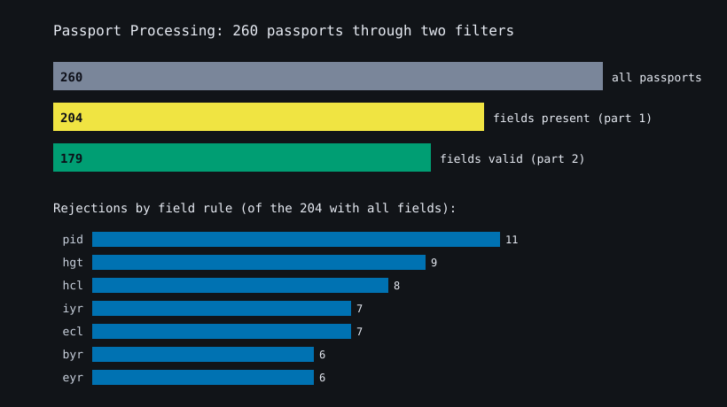
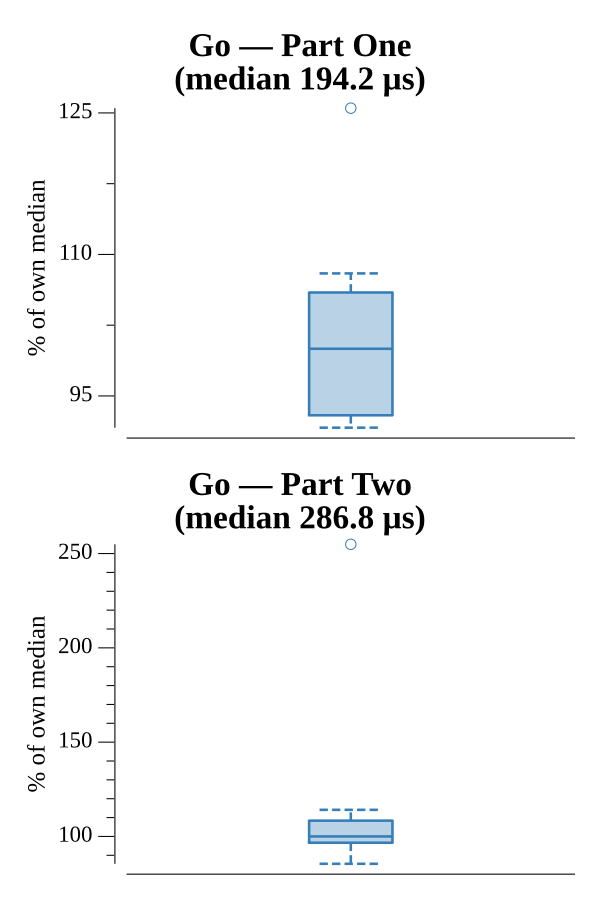

# [Day 4: Passport Processing](https://adventofcode.com/2020/day/4)

<!-- These are helper text to make formatting the yearly readme consistent and easier...

[Day 4: Passport Processing][rm4]
[Go][go4]

[rm4]: 04-passportProcessing/README.md
[go4]: 04-passportProcessing/go

-->

## Notes

Passports are blank-line-separated records of `key:value` fields, spread freely
across lines and spaces — so parsing scans every `key:value` token per record
rather than relying on line positions. A passport needs seven fields (`byr iyr
eyr hgt hcl ecl pid`); `cid` is optional.

- **Part One** counts passports that have all required fields present.
- **Part Two** additionally validates each field: year ranges, height in cm/in,
  a `#`-prefixed 6-digit hex color, an eye color from a fixed set, and a 9-digit
  passport id.

The AoC page gives Part Two examples as separate all-invalid and all-valid
batches (0 and 4), so the validator was checked against those rather than a single
mixed test case.

## Go

```text
────────────────────────────────────────
─   2020 Day 4: Passport Processing    ─
────────────────────────────────────────

Solving (Go)…
1.0:  PASS           210.779µs
2.0:  PASS           291.883µs
```

## Visualization

The batch passing through the two filters: all passports, then those with every
field present (Part One), then those whose fields are also valid (Part Two).
Below, a per-field rejection chart shows which rule most often disqualifies the
passports that had every field but still failed — led by `pid`, `hgt`, and `hcl`
— explaining the drop from 204 to 179. Bars use colorblind-safe colors ordered by
brightness and are labeled with counts, so the chart reads in grayscale.



## Run Times


