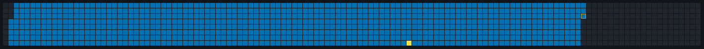
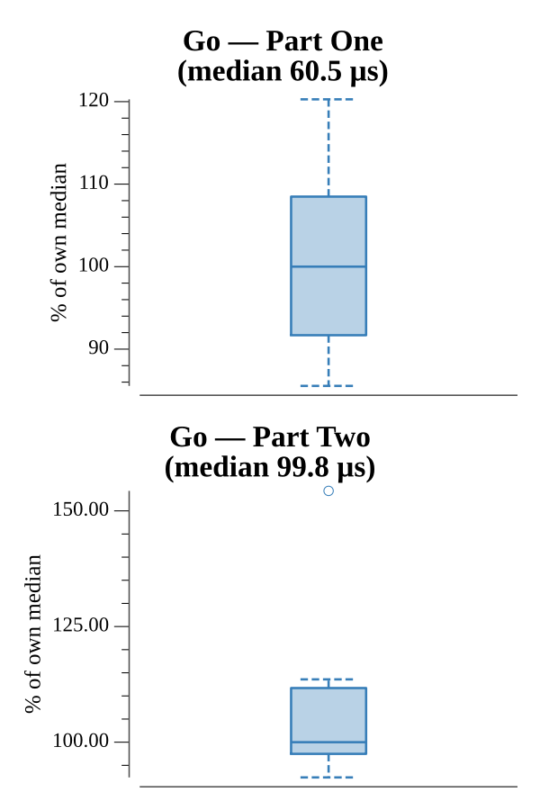

# [Day 5: Binary Boarding](https://adventofcode.com/2020/day/5)

<!-- These are helper text to make formatting the yearly readme consistent and easier...

[Day 5: Binary Boarding][rm5]
[Go][go5]

[rm5]: 05-binaryBoarding/README.md
[go5]: 05-binaryBoarding/go

-->

## Notes

Each boarding pass is binary space partitioning, but the row/column split is a
red herring: a pass is just a 10-bit number with `B`/`R` as 1 and `F`/`L` as 0,
and the seat ID `row*8 + col` is exactly that number (the column is the low three
bits, the row the high seven). Decoding is a single pass over the characters.

- **Part One** is the highest seat ID.
- **Part Two** is your seat: the one empty ID whose neighbors (ID-1 and ID+1) are
  both occupied, searched only within the occupied range so the empty front and
  back rows are ignored.

## Go

```text
────────────────────────────────────────
─     2020 Day 5: Binary Boarding      ─
────────────────────────────────────────

Solving (Go)…
1.0:  PASS            55.722µs
2.0:  PASS           103.569µs
```

## Visualization

The plane as a seat grid (seat ID = row*8 + col), with the 128 rows running
left-to-right and the 8 columns top-to-bottom. Occupied seats are blue, empty
seats dark; the empty front and back rows are why the Part Two search brackets to
the occupied range. The highest ID (Part One) is outlined in orange, and your
seat (Part Two) is the bright yellow cell — the lone empty seat surrounded by
occupied ones. The highlights use a wide brightness gap, so they read in
grayscale.



## Run Times


