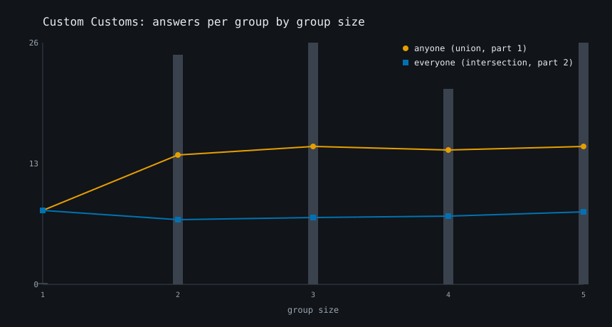
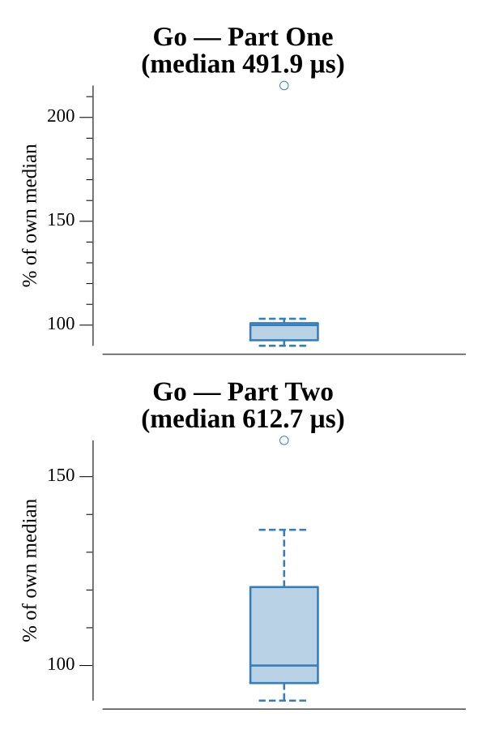

# [Day 6: Custom Customs](https://adventofcode.com/2020/day/6)

<!-- These are helper text to make formatting the yearly readme consistent and easier...

[Day 6: Custom Customs][rm6]
[Go][go6]

[rm6]: 06-customCustoms/README.md
[go6]: 06-customCustoms/go

-->

## Notes

Groups are blank-line-separated; each line is one person's yes answers. The two
parts sum a different set operation per group:

- **Part One** counts the questions anyone answered yes — the union of letters
  across the group.
- **Part Two** counts the questions everyone answered yes — the intersection,
  found by tallying each letter and keeping those whose count equals the group
  size.

## Go

```text
────────────────────────────────────────
─      2020 Day 6: Custom Customs      ─
────────────────────────────────────────

Solving (Go)…
1.0:  PASS           534.531µs
2.0:  PASS           633.666µs
```

## Visualization

The two counting rules as a function of group size. For each size, the mean
"anyone" count (union, Part One) and mean "everyone" count (intersection, Part
Two) are plotted: at size 1 they coincide, then the union rises while the
intersection stays low — more people means more distinct yeses but fewer
unanimous ones. Gray bars behind the curves show how many groups have each size.
The two series use colorblind-safe colors and distinct markers (circles vs
squares), so they stay distinguishable in grayscale.



## Run Times


