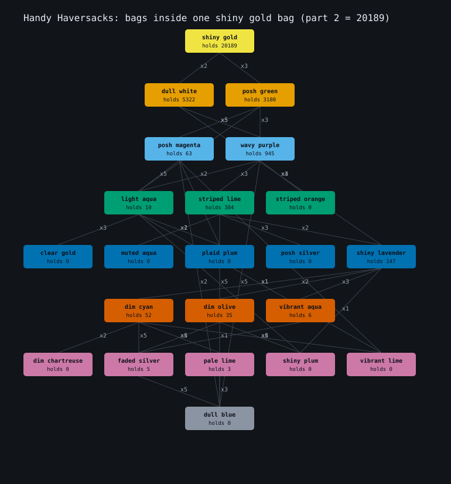
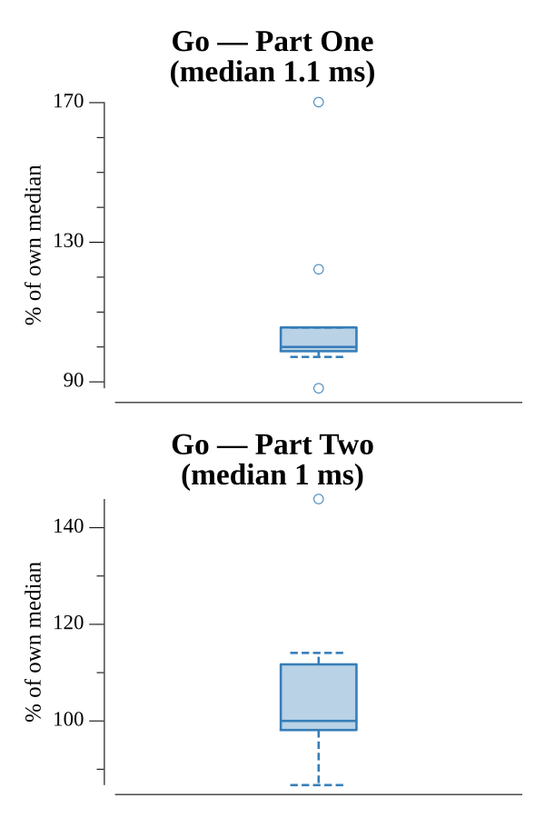

# [Day 7: Handy Haversacks](https://adventofcode.com/2020/day/7)

<!-- These are helper text to make formatting the yearly readme consistent and easier...

[Day 7: Handy Haversacks][rm7]
[Go][go7]

[rm7]: 07-handyHaversacks/README.md
[go7]: 07-handyHaversacks/go

-->

## Notes

The rules form a containment DAG: each bag color maps to the counted colors it
directly holds. The two parts walk it in opposite directions:

- **Part One** is reverse reachability. Invert the graph (child color → parents),
  then BFS out from `shiny gold` and count the colors reached — every bag that can
  eventually contain a shiny gold bag.
- **Part Two** is a forward recursive sum, memoized over colors: a bag holds
  `sum(count * (1 + countInside(child)))` bags.

## Go

```text
────────────────────────────────────────
─     2020 Day 7: Handy Haversacks     ─
────────────────────────────────────────

Solving (Go)…
1.0:  PASS             1.197ms
2.0:  PASS             1.002ms
```

## Visualization

The containment DAG rooted at shiny gold — the bags that must go inside it (Part
Two). Each distinct color is a node placed on the row for its deepest position
below shiny gold, edges are labeled with how many of the child bag each parent
holds, and every node shows the total bags contained within one bag of that
color. Reading down from `shiny gold: holds 20189` to the empty `dull blue` leaf
shows the multiplication cascading up to the answer. Depth is encoded by row
position as well as a colorblind-safe color ramp, and every node and edge is
labeled, so the graph reads in grayscale.



## Run Times


