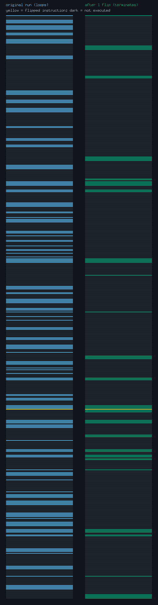
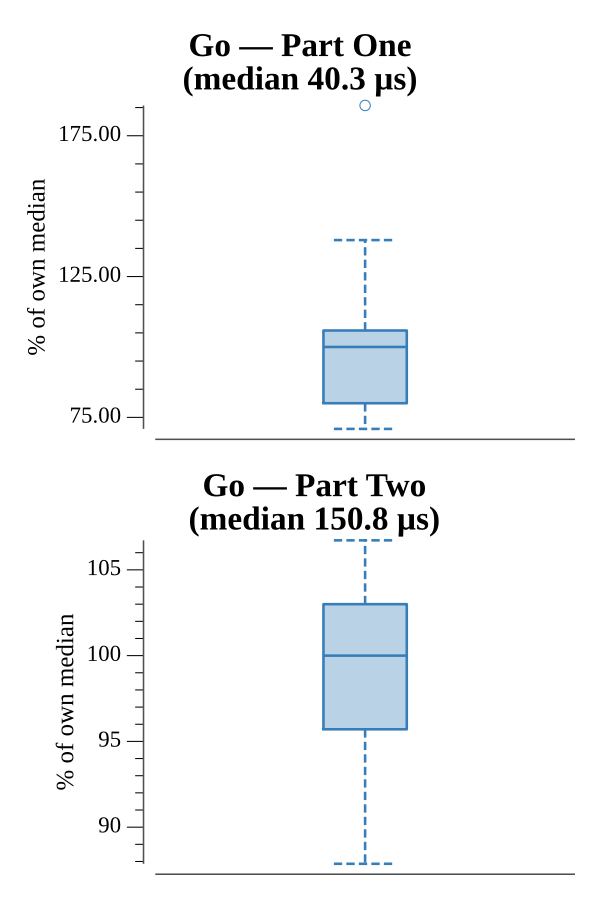

# [Day 8: Handheld Halting](https://adventofcode.com/2020/day/8)

<!-- These are helper text to make formatting the yearly readme consistent and easier...

[Day 8: Handheld Halting][rm8]
[Go][go8]

[rm8]: 08-handheldHalting/README.md
[go8]: 08-handheldHalting/go

-->

## Notes

The boot code is a tiny VM with three ops: `acc` adds to an accumulator, `jmp`
offsets the instruction pointer, `nop` does nothing. A shared `run` executes until
an instruction is about to repeat (returning the accumulator and "looped") or the
pointer runs off the end (returning "terminated").

- **Part One** runs the program and reports the accumulator just before the first
  repeat.
- **Part Two** flips each `jmp`↔`nop` in turn and re-runs; the one flip that lets
  the program terminate gives the answer.

## Go

```text
────────────────────────────────────────
─     2020 Day 8: Handheld Halting     ─
────────────────────────────────────────

Solving (Go)…
1.0:  PASS            38.804µs
2.0:  PASS           150.560µs
```

## Visualization

The boot program as two side-by-side columns of instruction rows: the original
run that ends in an infinite loop (left, blue) and the repaired run after the
single `jmp`↔`nop` flip that lets it terminate (right, green). Each row is bright
if that run executes it and dark otherwise, and the flipped instruction is marked
yellow — so the two very different execution paths, and the one edge that unlocks
termination, are visible. Executed rows are the brightest, so the paths read in
grayscale.



## Run Times


