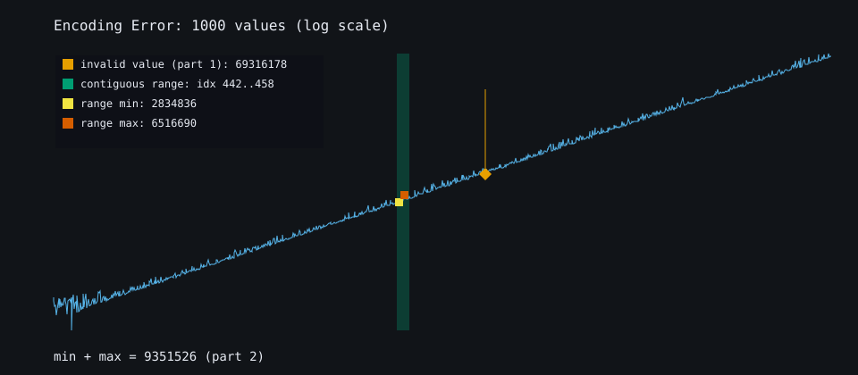
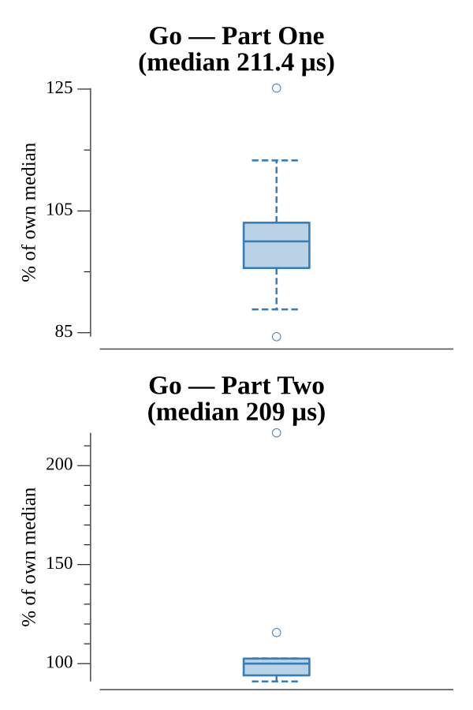

# [Day 9: Encoding Error](https://adventofcode.com/2020/day/9)

<!-- These are helper text to make formatting the yearly readme consistent and easier...

[Day 9: Encoding Error][rm9]
[Go][go9]

[rm9]: 09-encodingError/README.md
[go9]: 09-encodingError/go

-->

## Notes

XMAS validation over a sliding preamble. The preamble size differs between the
example (5) and the real input (25), so it is inferred from the input length.

- **Part One** finds the first number that is not a sum of two of the preceding
  `w` numbers, using a complement set per window.
- **Part Two** finds the contiguous range summing to that number with a sliding
  window (grow the right edge, shrink the left while over target) and returns the
  sum of the range's smallest and largest members.

## Go

```text
────────────────────────────────────────
─      2020 Day 9: Encoding Error      ─
────────────────────────────────────────

Solving (Go)…
1.0:  PASS           222.612µs
2.0:  PASS           248.306µs
```

## Visualization

The number stream on a log scale (values climb steadily), with both answers
marked: the invalid value (Part One) flagged with an orange diamond, and the
contiguous range that sums to it (Part Two) shaded green, with its smallest and
largest members squared in yellow and vermilion. A legend carries the exact
values so the dense region near the range stays readable, and every mark uses a
colorblind-safe color with a labeled legend entry, so it reads in grayscale.



## Run Times


