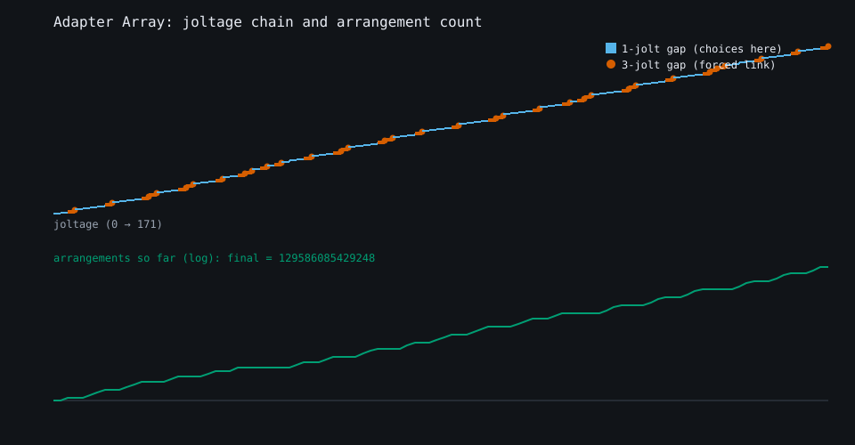
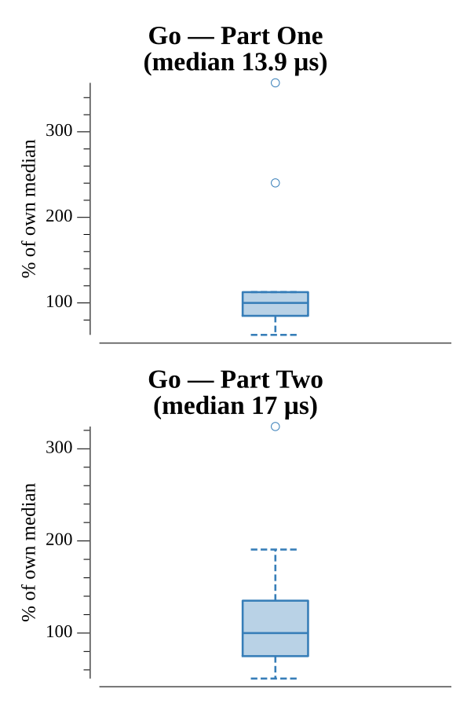

# [Day 10: Adapter Array](https://adventofcode.com/2020/day/10)

<!-- These are helper text to make formatting the yearly readme consistent and easier...

[Day 10: Adapter Array][rm10]
[Go][go10]

[rm10]: 10-adapterArray/README.md
[go10]: 10-adapterArray/go

-->

## Notes

Sort the adapters and bookend the chain with the outlet (0) and device (max + 3),
which are both forced to be included.

- **Part One** walks the sorted chain counting 1-jolt and 3-jolt differences and
  returns their product.
- **Part Two** counts distinct arrangements with a DP: `ways[i]` is the sum of
  `ways[j]` for each earlier adapter within 3 jolts, seeded with `ways[0] = 1`.
  The counts reach into the trillions, so 64-bit `int` is required.

## Go

```text
────────────────────────────────────────
─      2020 Day 10: Adapter Array      ─
────────────────────────────────────────

Solving (Go)…
1.0:  PASS            10.704µs
2.0:  PASS            10.822µs
```

## Visualization

The sorted joltage chain (top) drawn as a staircase, with each step colored by
its gap to the previous adapter: 1-jolt steps in blue, 3-jolt forced links in
vermilion with a dot marker. The bottom panel plots the running number of
arrangements on a log scale — it jumps inside each run of 1-jolt gaps (where the
choices are) and plateaus across every forced 3-jolt link, climbing to
129,586,085,429,248. The 3-jolt links are marked by shape as well as color, so
the two gap types stay distinct in grayscale.



## Run Times


