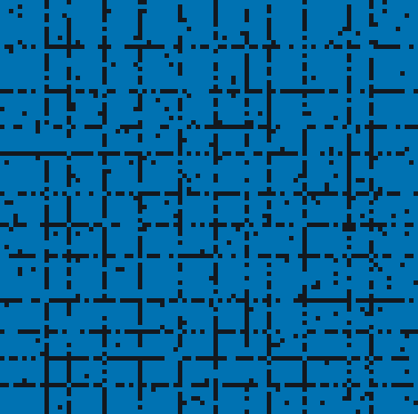
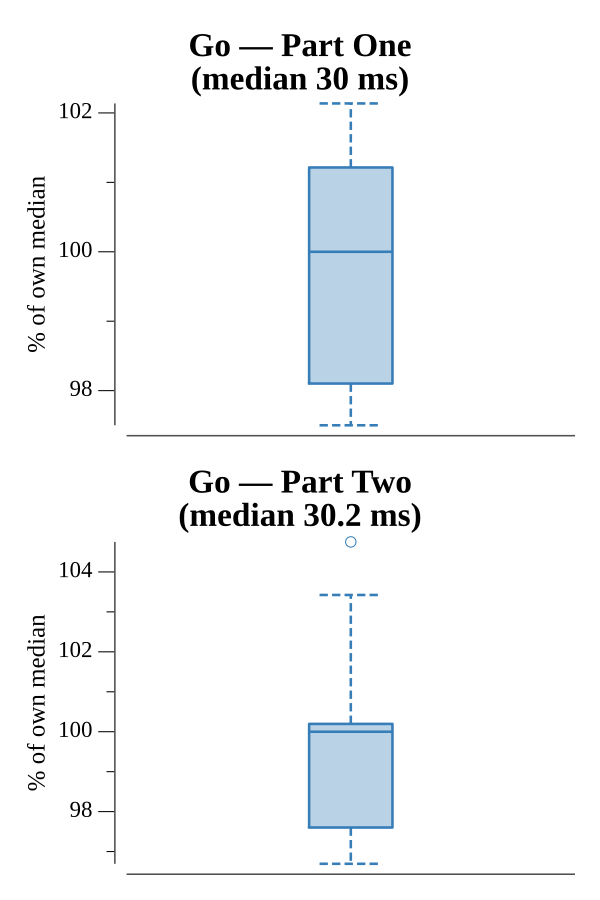

# [Day 11: Seating System](https://adventofcode.com/2020/day/11)

<!-- These are helper text to make formatting the yearly readme consistent and easier...

[Day 11: Seating System][rm11]
[Go][go11]

[rm11]: 11-seatingSystem/README.md
[go11]: 11-seatingSystem/go

-->

## Notes

A Conway-style cellular automaton on a grid of floor, empty seats, and occupied
seats: an empty seat with no crowding fills, an occupied seat with too much
crowding empties, and the layout is iterated to a fixed point. Both parts share
one `stabilize` loop; only the neighbor rule and threshold differ.

- **Part One** counts the eight adjacent seats and empties a seat at 4 occupied.
- **Part Two** counts the first visible seat in each of the eight directions
  (seeing over floor) and empties a seat at 5 occupied.

## Go

```text
────────────────────────────────────────
─     2020 Day 11: Seating System      ─
────────────────────────────────────────

Solving (Go)…
1.0:  PASS            30.643ms
2.0:  PASS            31.173ms
```

## Visualization

The seats settling under the Part Two line-of-sight rules, animated. Because a
seat's influence travels across aisles, the pattern settles less locally than
Part One. Floor is dark, empty seats are blue, and occupied seats are bright
yellow — three tones with a wide brightness gap, so the states stay distinct in
grayscale. The animation captures every early frame and samples the settling
tail, holding on the final stable layout.



## Run Times


