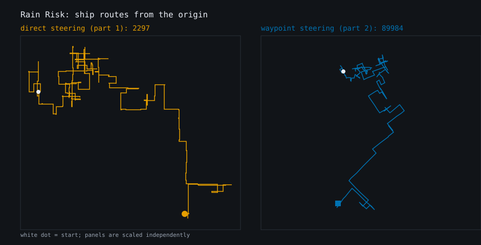
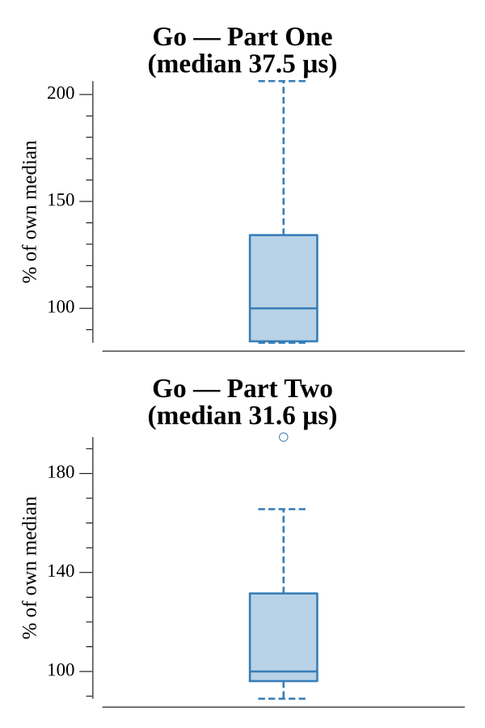

# [Day 12: Rain Risk](https://adventofcode.com/2020/day/12)

<!-- These are helper text to make formatting the yearly readme consistent and easier...

[Day 12: Rain Risk][rm12]
[Go][go12]

[rm12]: 12-rainRisk/README.md
[go12]: 12-rainRisk/go

-->

## Notes

Ship navigation from an instruction list (`N/S/E/W` move, `L/R` turn, `F`
forward). Both parts track a position and a direction vector; `L`/`R` rotate that
vector by 90-degree steps with a shared `rotate` helper. Only the meaning of the
vector differs:

- **Part One**: the vector is the ship's heading. `N/S/E/W` shift the ship, `F`
  moves it along the heading.
- **Part Two**: the vector is a waypoint offset. `N/S/E/W` move the waypoint,
  `F` moves the ship toward the waypoint that many times, and `L/R` rotate the
  waypoint around the ship.

Both answers are the Manhattan distance from the origin.

## Go

```text
────────────────────────────────────────
─        2020 Day 12: Rain Risk        ─
────────────────────────────────────────

Solving (Go)…
1.0:  PASS            31.098µs
2.0:  PASS            35.488µs
```

## Visualization

The two ship trajectories, each in its own independently scaled panel — the
waypoint route travels roughly 40x farther than the direct route, so a shared
scale would shrink the direct one to nothing. Each panel traces the route from
the origin (white dot) to its endpoint, titled with its Manhattan distance
answer. The panels use colorblind-safe colors and distinct end-marker shapes
(circle vs square), so they read in grayscale.



## Run Times


