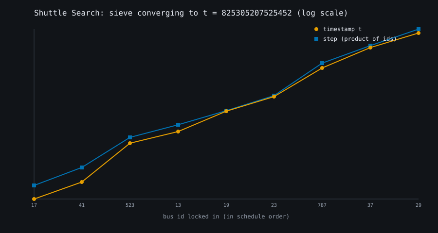
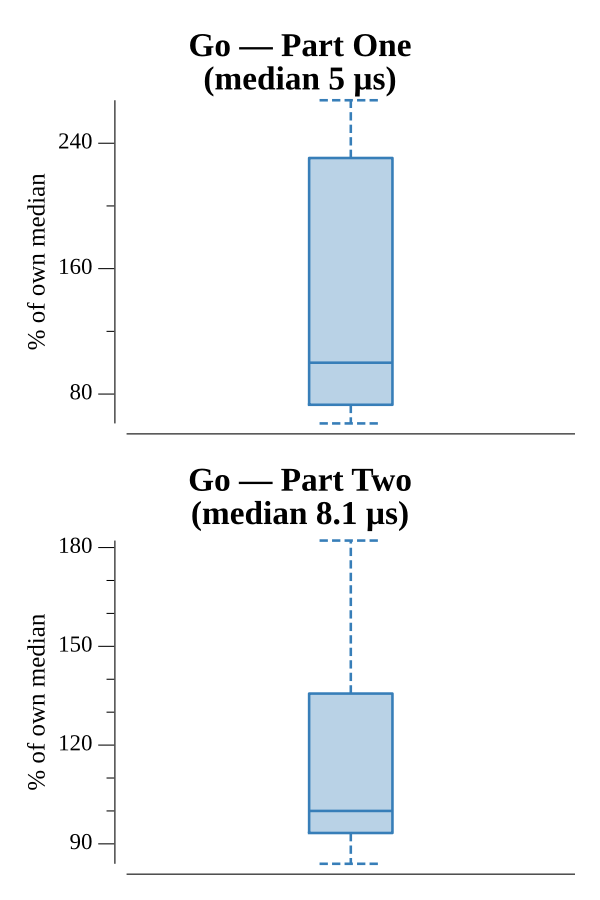

# [Day 13: Shuttle Search](https://adventofcode.com/2020/day/13)

<!-- These are helper text to make formatting the yearly readme consistent and easier...

[Day 13: Shuttle Search][rm13]
[Go][go13]

[rm13]: 13-shuttleSearch/README.md
[go13]: 13-shuttleSearch/go

-->

## Notes

The schedule line lists bus IDs by position; `x` means out of service.

- **Part One** finds the bus with the smallest wait `(id - earliest % id) % id`
  after the timestamp and returns `id * wait`.
- **Part Two** finds the earliest `t` where each bus departs at `t + offset`
  (`t ≡ -offset mod id`) with an incremental sieve: lock in each bus by stepping
  `t` forward, then multiply the step by that bus's id. Since the ids are pairwise
  coprime, stepping by the product preserves every earlier constraint, so the
  search finishes in one pass. The answer exceeds 2^32, so 64-bit `int` is needed.

## Go

```text
────────────────────────────────────────
─     2020 Day 13: Shuttle Search      ─
────────────────────────────────────────

Solving (Go)…
1.0:  PASS            43.758µs
2.0:  PASS            12.126µs
```

## Visualization

How the Part Two sieve converges. As each bus is locked in (x axis, in schedule
order), the running timestamp `t` rises and the step multiplies by that bus's id,
both climbing on a log scale toward `t = 825305207525452` in as many iterations as
there are buses. The step stays just above `t` at every stage — the sieve
invariant. The two series use colorblind-safe colors and distinct markers
(circle vs square), so they read in grayscale.



## Run Times


