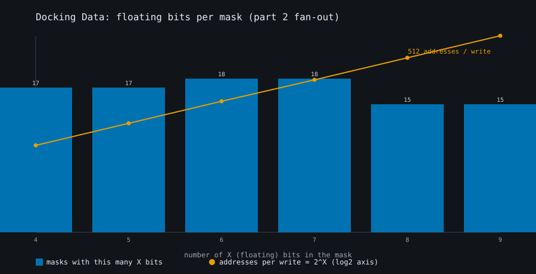
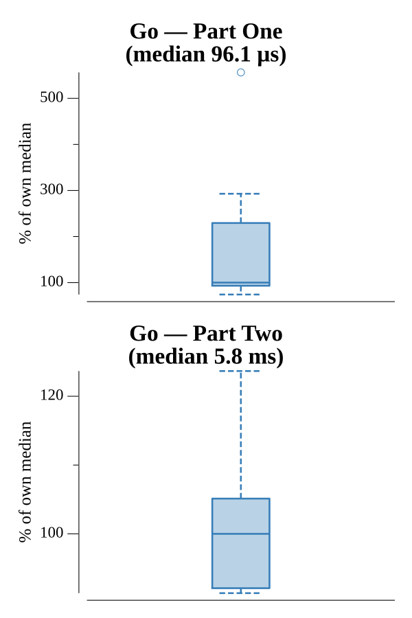

# [Day 14: Docking Data](https://adventofcode.com/2020/day/14)

<!-- These are helper text to make formatting the yearly readme consistent and easier...

[Day 14: Docking Data][rm14]
[Go][go14]

[rm14]: 14-dockingData/README.md
[go14]: 14-dockingData/go

-->

## Notes

A 36-bit mask applied differently in each part.

- **Part One** masks the value: the string becomes an OR mask (force 1s) and an
  AND mask (force 0s), so each write is `(value | or) & and` — `X` positions pass
  the value bit through.
- **Part Two** masks the address: `1` forces a bit on, `0` leaves it, and each
  `X` is a floating bit that fans out to both 0 and 1. A mask with `k` floating
  bits writes to `2^k` addresses.

Both sum the final memory, keyed by address in a map.

## Go

```text
────────────────────────────────────────
─      2020 Day 14: Docking Data       ─
────────────────────────────────────────

Solving (Go)…
1.0:  PASS             0.103ms
2.0:  PASS             6.440ms
```

## Visualization

Why Part Two fans out. The bars show how many masks in the program have each
number of `X` (floating) bits — clustered around 4 to 9 — and the curve shows how
many addresses each such write expands to, `2^X`, on a log2 axis. A single write
under a 9-X mask touches 512 addresses, which is what makes Part Two expensive.
Bars and the exponential curve use distinct colorblind-safe colors and the curve
carries point markers, so the chart reads in grayscale.



## Run Times


