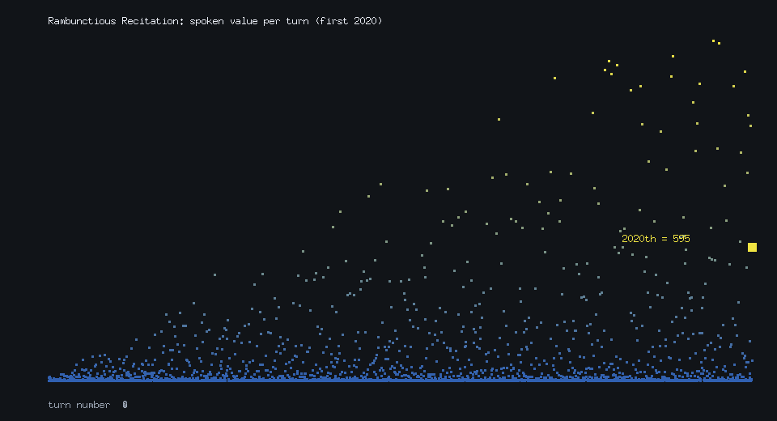
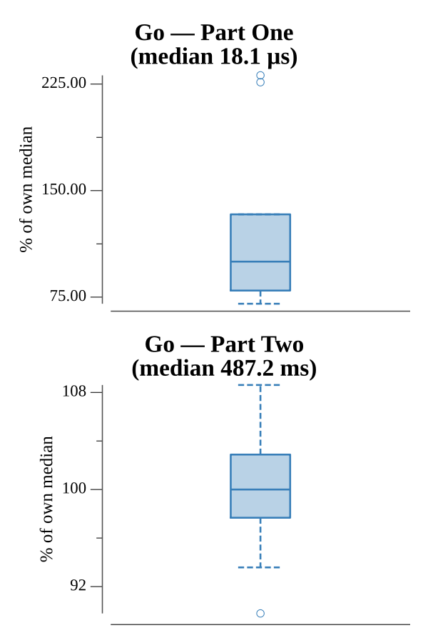

# [Day 15: Rambunctious Recitation](https://adventofcode.com/2020/day/15)

<!-- These are helper text to make formatting the yearly readme consistent and easier...

[Day 15: Rambunctious Recitation][rm15]
[Go][go15]

[rm15]: 15-rambunctiousRecitation/README.md
[go15]: 15-rambunctiousRecitation/go

-->

## Notes

A Van Eck-style memory game: each turn speaks 0 if the previous number was new,
otherwise the gap between its last two occurrences. Only "the turn each number was
last spoken" needs tracking, so the state is a single lookup keyed by value.

- **Part One** returns the 2020th number.
- **Part Two** returns the 30,000,000th. There is no cycle to exploit, so it
  genuinely runs 30M iterations — a flat `[]int32` indexed by value (sized to the
  target) rather than a hash map keeps that fast, since values stay below the turn
  count. Both parts share one `play(start, target)` loop.

## Go

```text
────────────────────────────────────────
─ 2020 Day 15: Rambunctious Recitation ─
────────────────────────────────────────

Solving (Go)…
1.0:  PASS             0.013ms
2.0:  PASS           540.275ms
```

## Visualization

The spoken value plotted against the turn number for the opening 2020 turns. The
sequence has a distinctive texture: a dense band of small values and zeros along
the bottom (every time a brand-new number is spoken), with sparser points fanning
upward as older gaps grow. Points brighten with value, the 2020th turn — the Part
One answer — is marked, and value is encoded by vertical position as well as
brightness, so the structure reads in grayscale.



## Run Times


