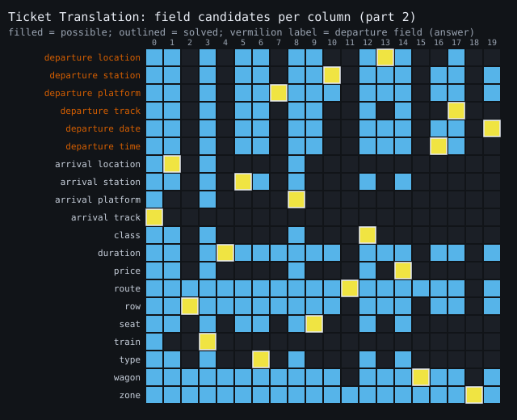
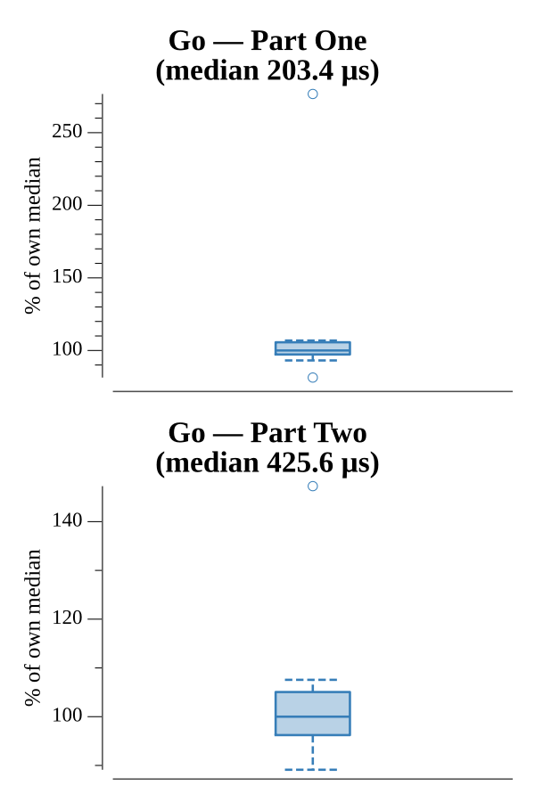

# [Day 16: Ticket Translation](https://adventofcode.com/2020/day/16)

<!-- These are helper text to make formatting the yearly readme consistent and easier...

[Day 16: Ticket Translation][rm16]
[Go][go16]

[rm16]: 16-ticketTranslation/README.md
[go16]: 16-ticketTranslation/go

-->

## Notes

Three blocks: field rules (each a name and two valid ranges), your ticket, and
nearby tickets.

- **Part One** sums every nearby-ticket value that is valid for no field at all —
  the scanning error rate.
- **Part Two** discards those invalid tickets, then deduces which field belongs to
  each column: a column's candidates are the fields whose ranges accept every
  remaining ticket's value there, and constraint propagation locks in each column
  that has a single candidate until all are assigned. The answer is the product of
  your ticket's six `departure` values.

## Go

```text
────────────────────────────────────────
─   2020 Day 16: Ticket Translation    ─
────────────────────────────────────────

Solving (Go)…
1.0:  PASS           234.832µs
2.0:  PASS           380.705µs
```

## Visualization

The Part Two constraint matrix: rows are fields, columns are ticket positions,
and a filled cell means that field could occupy that column (its ranges accept
every valid ticket's value there). Constraint propagation reduces this dense grid
to one field per column — those solved cells are outlined in white — and the six
`departure` fields whose product is the answer are labeled in vermilion at the
top. Candidates, the solved assignment (outline), and the departure rows
(position and label) are distinguished by more than color, so the grid reads in
grayscale.



## Run Times


