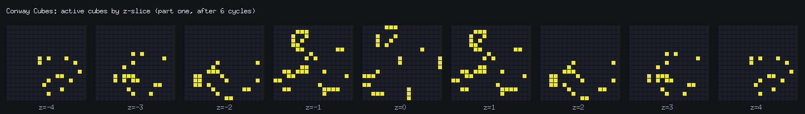
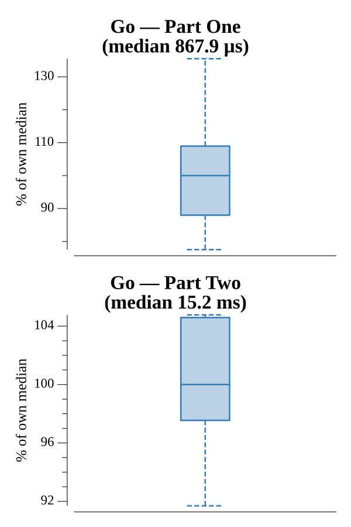

# [Day 17: Conway Cubes](https://adventofcode.com/2020/day/17)

<!-- These are helper text to make formatting the yearly readme consistent and easier...

[Day 17: Conway Cubes][rm17]
[Go][go17]

[rm17]: 17-conwayCubes/README.md
[go17]: 17-conwayCubes/go

-->

## Notes

Game of Life in higher dimensions over an infinite grid. Active cells are stored
sparsely in a coordinate set, and each cycle tallies active-neighbor counts by
iterating the active cells and bumping all of their neighbor slots — cost scales
with the number of active cells, not the bounding volume. A shared 4D `coord`
(with unused axes pinned to 0) and a dimension-aware neighbor-offset generator let
both parts run the same simulation.

- **Part One** runs 6 cycles in 3D (26 neighbors).
- **Part Two** runs 6 cycles in 4D (80 neighbors).

## Go

```text
────────────────────────────────────────
─      2020 Day 17: Conway Cubes       ─
────────────────────────────────────────

Solving (Go)…
1.0:  PASS             0.884ms
2.0:  PASS            16.671ms
```

## Visualization

The final 3D state (Part One, after 6 cycles) exploded into z-slices: each panel
is the x/y grid of active cubes at one z level, laid out from the most negative z
to the most positive. Since the seed lives on z=0, the structure is symmetric
about the center panel — the z=-4 and z=+4 slices match, and so on inward. Active
cubes are bright on a dark field, an active/inactive distinction that is
inherently readable in grayscale, and each panel is labeled with its z.



## Run Times


