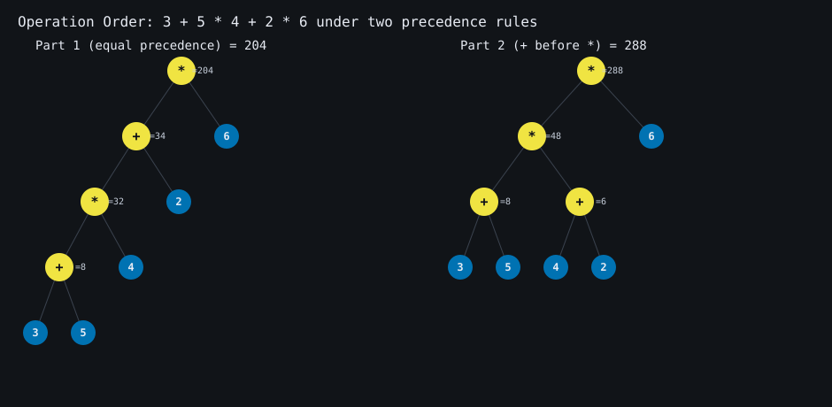
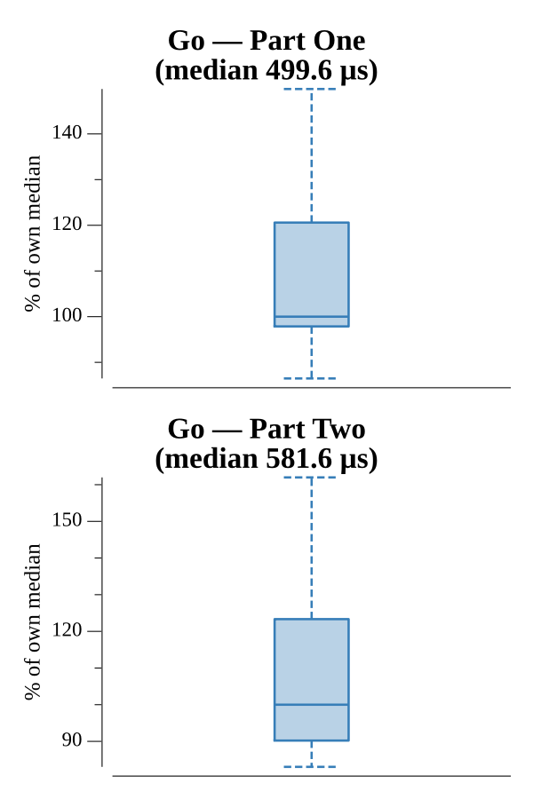

# [Day 18: Operation Order](https://adventofcode.com/2020/day/18)

<!-- These are helper text to make formatting the yearly readme consistent and easier...

[Day 18: Operation Order][rm18]
[Go][go18]

[rm18]: 18-operationOrder/README.md
[go18]: 18-operationOrder/go

-->

## Notes

Evaluate arithmetic expressions with non-standard precedence and sum the results.
Both parts share one precedence-climbing parser driven by an operator-precedence
map; only the map changes:

- **Part One**: `+` and `*` have equal precedence (evaluated left to right).
- **Part Two**: `+` binds tighter than `*` (addition before multiplication).

Parentheses recurse into a fresh sub-parse at the lowest level.

## Go

```text
────────────────────────────────────────
─     2020 Day 18: Operation Order     ─
────────────────────────────────────────

Solving (Go)…
1.0:  PASS           705.962µs
2.0:  PASS           644.335µs
```

## Visualization

One expression, `3 + 5 * 4 + 2 * 6`, parsed under both rules. Under Part One's
equal precedence it becomes a left-leaning chain evaluating to 204; under Part
Two's addition-first rule the `+` operations group into subtrees below the `*`,
giving 288 — the same tokens, a different tree, a different answer. Operator
nodes and number leaves are drawn with distinct colorblind-safe colors, but each
node also carries its glyph (`+`/`*` or a digit) and every subtree its value, so
the diagram reads in grayscale.



## Run Times


