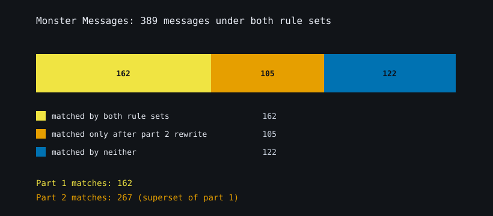
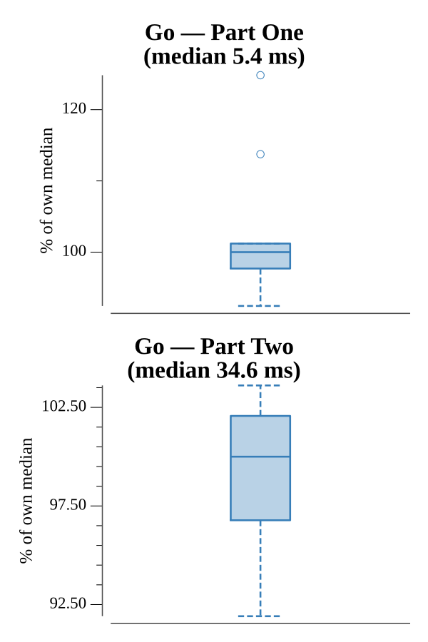

# [Day 19: Monster Messages](https://adventofcode.com/2020/day/19)

<!-- These are helper text to make formatting the yearly readme consistent and easier...

[Day 19: Monster Messages][rm19]
[Go][go19]

[rm19]: 19-monsterMessages/README.md
[go19]: 19-monsterMessages/go

-->

## Notes

A grammar of numbered rules (literals, sequences, and `|` alternations) matched
against messages. The matcher `match(id, s, pos)` returns the *set* of end
positions reachable after matching a rule — returning a set, not a single bool, is
what makes alternations and Part Two's recursion work. A message matches rule 0
iff `len(s)` is among the ends reachable from position 0.

- **Part One** counts messages fully matching rule 0.
- **Part Two** rewrites rule 8 to `42 | 42 8` (one or more 42s) and rule 11 to
  `42 31 | 42 11 31` (equal counts of 42 then 31). The same set-based matcher
  handles the recursion; the accepted messages become a strict superset of Part
  One's.

## Go

```text
────────────────────────────────────────
─    2020 Day 19: Monster Messages     ─
────────────────────────────────────────

Solving (Go)…
1.0:  PASS             6.105ms
2.0:  PASS            39.153ms
```

## Visualization

How the recursive rewrite enlarges the matched set. Each of the 389 messages is
classified as matched by both rule sets, matched only after the Part Two rewrite,
or matched by neither. The stacked bar shows Part Two's matches (162 + 105 = 267)
are a strict superset of Part One's (162) — the recursive rules only ever accept
more. Segments use colorblind-safe colors ordered by brightness and every one is
labeled, so the chart reads in grayscale.



## Run Times


