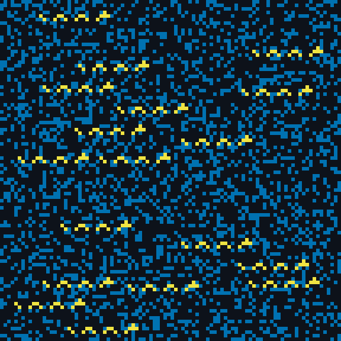
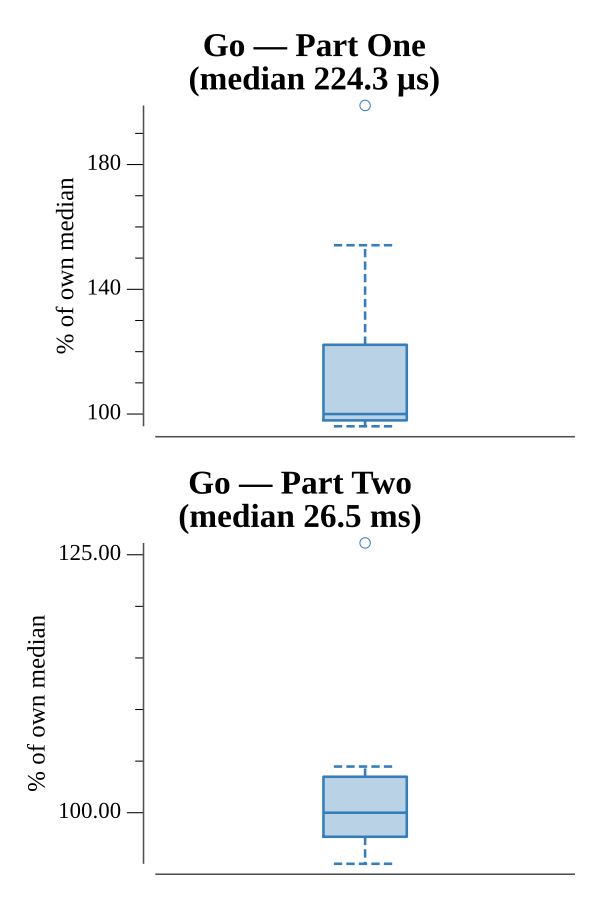

# [Day 20: Jurassic Jigsaw](https://adventofcode.com/2020/day/20)

<!-- These are helper text to make formatting the yearly readme consistent and easier...

[Day 20: Jurassic Jigsaw][rm20]
[Go][go20]

[rm20]: 20-jurassicJigsaw/README.md
[go20]: 20-jurassicJigsaw/go

-->

## Notes

144 tiles must be reassembled into a 12x12 image.

- **Part One** needs no assembly. Canonicalize each edge to `min(edge, reversed)`
  so a border and its flip compare equal, then count how many tiles share each
  edge. Corner tiles are the ones with exactly two edges unique to them; multiply
  the four corner IDs.
- **Part Two** assembles the full image: seed an oriented corner in the top-left,
  then greedily place each remaining tile in one of its 8 orientations so its left
  and top edges match the already-placed neighbors. Strip every tile's one-cell
  border, stitch the bodies together, and search all 8 orientations of the result
  for the sea-monster pattern. The answer is the count of `#` cells not part of
  any monster.

## Go

```text
────────────────────────────────────────
─     2020 Day 20: Jurassic Jigsaw     ─
────────────────────────────────────────

Solving (Go)…
1.0:  PASS             0.294ms
2.0:  PASS            32.120ms
```

## Visualization

The fully assembled image in the orientation where the sea monsters appear. Calm
sea is dark, rough water (`#` cells not part of a monster) is blue, and every cell
belonging to a sea monster is bright yellow. The water roughness answer is the
count of blue cells. The three states have a wide brightness gap, so the monsters
stand out in grayscale as well as color.



## Run Times


