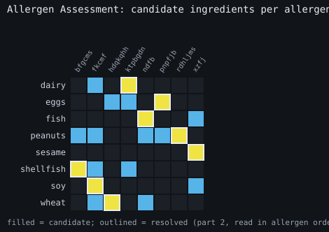
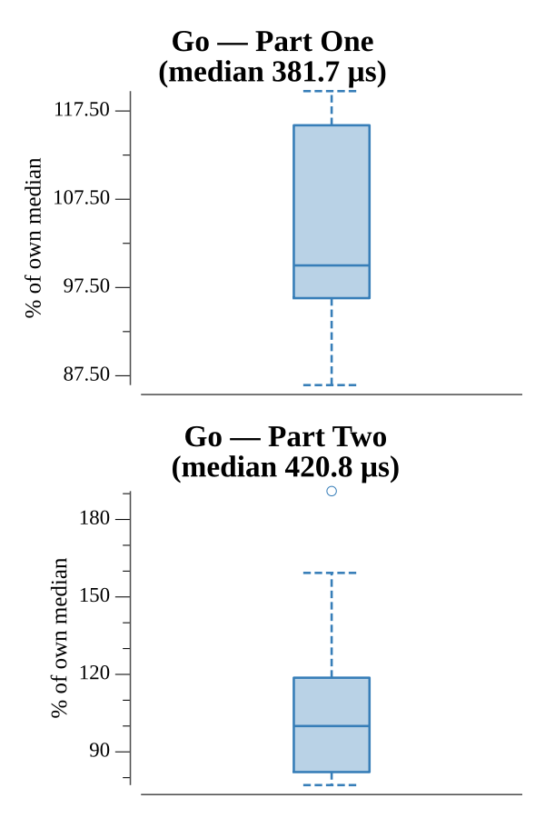

# [Day 21: Allergen Assessment](https://adventofcode.com/2020/day/21)

<!-- These are helper text to make formatting the yearly readme consistent and easier...

[Day 21: Allergen Assessment][rm21]
[Go][go21]

[rm21]: 21-allergenAssessment/README.md
[go21]: 21-allergenAssessment/go

-->

## Notes

Each allergen is carried by exactly one ingredient, but ingredients may be
listed in any language. An allergen's candidate ingredients are the intersection
of the ingredient lists across every food that declares it.

- **Part One** counts appearances of ingredients that are a candidate for no
  allergen — the safe ones.
- **Part Two** resolves the mapping by constraint propagation (repeatedly fix any
  allergen with a single candidate and remove that ingredient from the rest), then
  lists the dangerous ingredients ordered by allergen name, comma-joined.

## Go

```text
────────────────────────────────────────
─   2020 Day 21: Allergen Assessment   ─
────────────────────────────────────────

Solving (Go)…
1.0:  PASS           449.637µs
2.0:  PASS           418.145µs
```

## Visualization

The deduction as a candidate matrix: rows are allergens, columns are the suspect
ingredients (candidate for some allergen). A filled cell means that ingredient
could carry that allergen; constraint propagation reduces the matrix to one
ingredient per allergen, and those solved cells are outlined in white. Reading the
outlined cells down the rows in allergen-name order spells the Part Two answer.
Candidates and the solved matching are distinguished by outline and position as
well as color, so the grid reads in grayscale.



## Run Times


