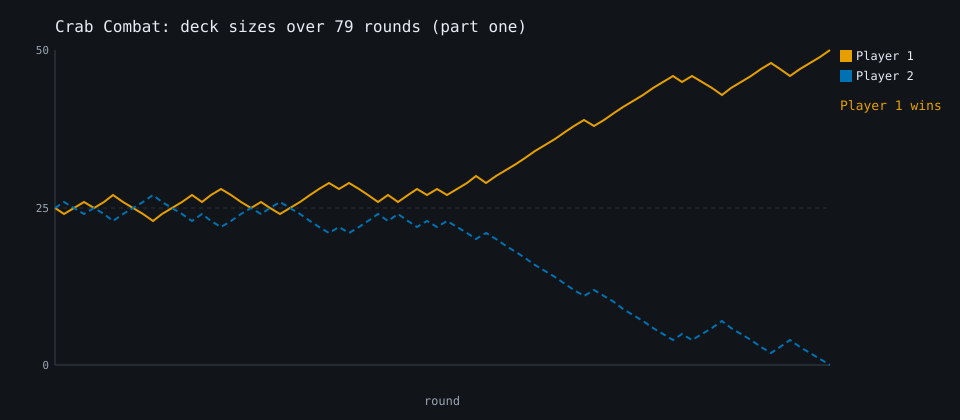
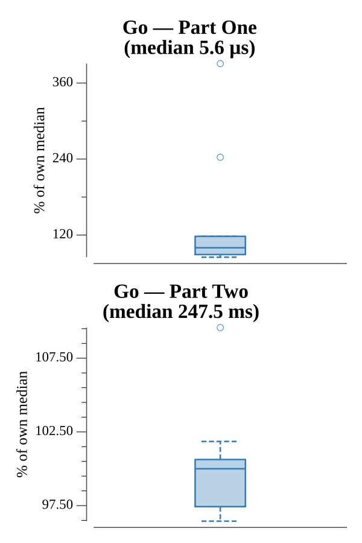

# [Day 22: Crab Combat](https://adventofcode.com/2020/day/22)

<!-- These are helper text to make formatting the yearly readme consistent and easier...

[Day 22: Crab Combat][rm22]
[Go][go22]

[rm22]: 22-crabCombat/README.md
[go22]: 22-crabCombat/go

-->

## Notes

A two-player card game scored by summing each card times its distance from the
bottom of the winning deck.

- **Part One** is plain Combat: each round the higher card wins both, taken to the
  back of the winner's deck.
- **Part Two** is Recursive Combat. A game tracks the deck states it has seen and
  awards it instantly to Player 1 if a state repeats (preventing infinite loops).
  When both players hold at least as many cards as the value they drew, the round
  is decided by a recursive sub-game on copies of the next N cards; otherwise the
  higher card wins as usual.

## Go

```text
────────────────────────────────────────
─       2020 Day 22: Crab Combat       ─
────────────────────────────────────────

Solving (Go)…
1.0:  PASS             0.021ms
2.0:  PASS           253.222ms
```

## Visualization

The two players' deck sizes over the standard Combat game (Part One) — a
tug-of-war that always sums to the full 50 cards, so the curves mirror each other
about the midline. The lead trades hands around round 25 before Player 1 pulls
away to take all the cards. Player 1 is solid and Player 2 is dashed, so the two
series stay distinct by line style as well as color, and the winner is annotated.



## Run Times


