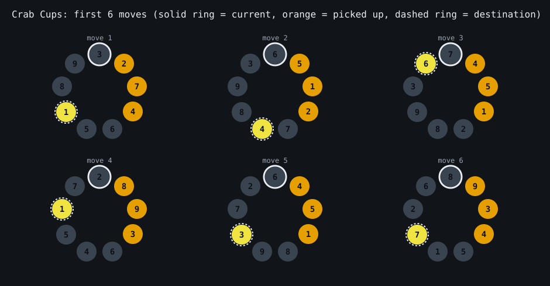
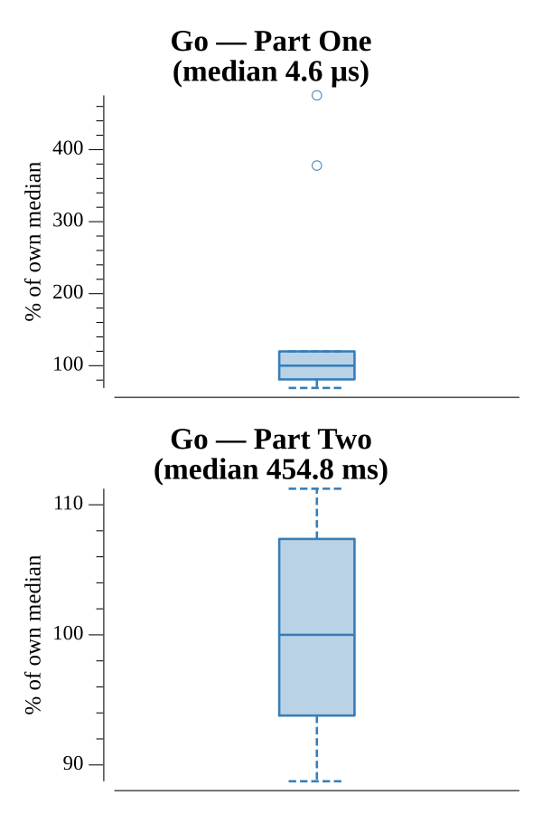

# [Day 23: Crab Cups](https://adventofcode.com/2020/day/23)

<!-- These are helper text to make formatting the yearly readme consistent and easier...

[Day 23: Crab Cups][rm23]
[Go][go23]

[rm23]: 23-crabCups/README.md
[go23]: 23-crabCups/go

-->

## Notes

The cups form a circular linked list represented as a `next` array: `next[label]`
is the cup clockwise after `label`. Each move splices the three cups after the
current one out and back in after the destination (`current - 1`, wrapping,
skipping the picked-up cups) in O(1), independent of ring size — which is what
makes Part Two tractable.

- **Part One** runs 100 moves on 9 cups and reads the labels after cup 1.
- **Part Two** extends to one million cups and runs ten million moves, returning
  the product of the two cups immediately clockwise of cup 1.

## Go

```text
────────────────────────────────────────
─        2020 Day 23: Crab Cups        ─
────────────────────────────────────────

Solving (Go)…
1.0:  PASS             0.011ms
2.0:  PASS           443.271ms
```

## Visualization

The first six moves of the small (Part One) ring, each drawn as a circular cup
arrangement. In every snapshot the current cup has a solid white ring, the three
cups about to be picked up are orange, and the destination they will be placed
after has a bright dashed ring. The three roles are marked by outline and shape as
well as color, so the move reads in grayscale.



## Run Times


