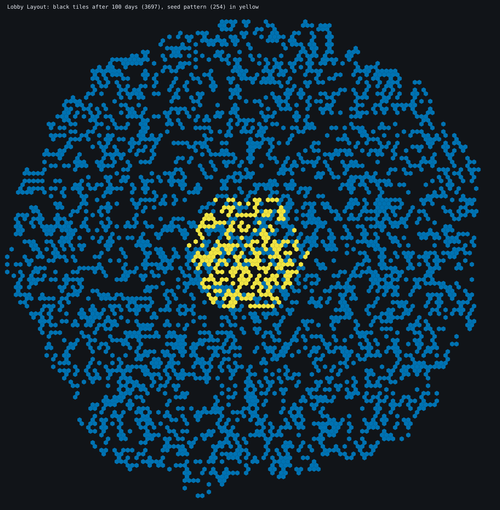
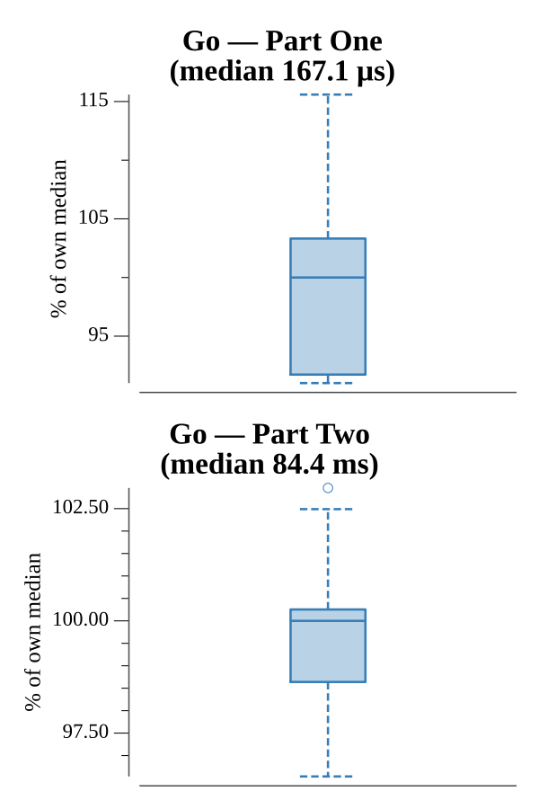

# [Day 24: Lobby Layout](https://adventofcode.com/2020/day/24)

<!-- These are helper text to make formatting the yearly readme consistent and easier...

[Day 24: Lobby Layout][rm24]
[Go][go24]

[rm24]: 24-lobbyLayout/README.md
[go24]: 24-lobbyLayout/go

-->

## Notes

Each line is a walk over a hex grid in axial coordinates (`e`, `w`, `ne`, `nw`,
`se`, `sw`), landing on a tile that gets flipped. The set of black tiles is the
state.

- **Part One** applies all the flip paths and counts black tiles (a tile flipped
  an odd number of times ends black).
- **Part Two** runs 100 days of a hex Game of Life: a black tile stays black only
  with 1 or 2 black neighbors, and a white tile turns black with exactly 2. Same
  sparse-set, neighbor-tally approach as day 17's Conway cubes, over the six hex
  neighbors.

## Go

```text
────────────────────────────────────────
─      2020 Day 24: Lobby Layout       ─
────────────────────────────────────────

Solving (Go)…
1.0:  PASS             0.213ms
2.0:  PASS            85.875ms
```

## Visualization

The black tiles drawn on a real hexagonal grid. The tiles flipped by the initial
paths (Part One, 254) are yellow at the center, and the tiles that are black after
100 days of the flipping rules (Part Two, 3697) are blue — so the compact seed and
the large organic disc it grows into are both visible. The two states differ in
brightness as well as color, so the growth reads in grayscale.



## Run Times


