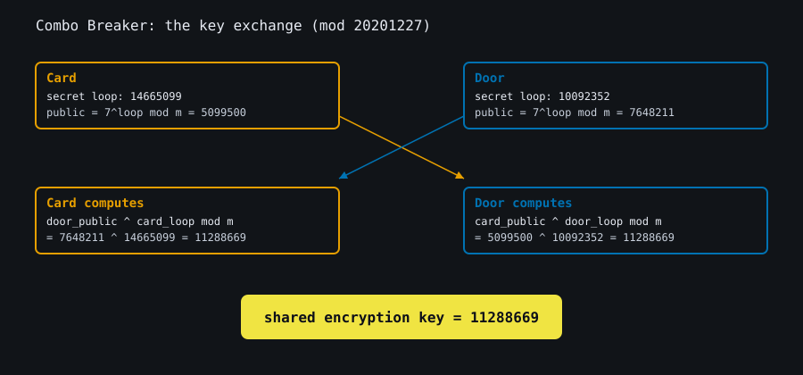
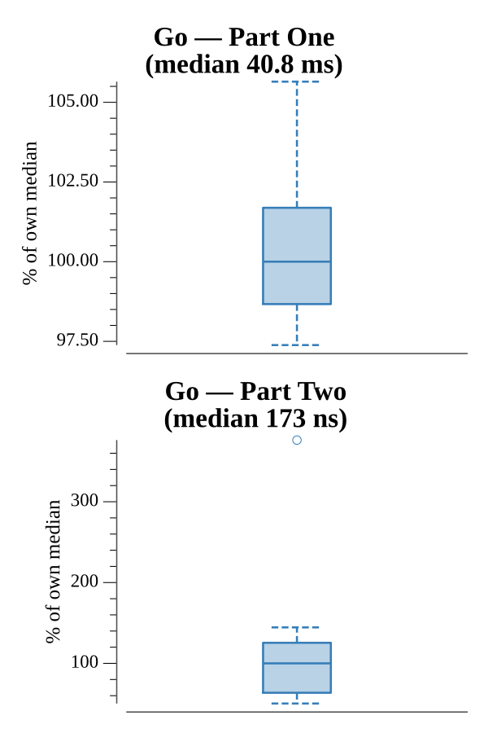

# [Day 25: Combo Breaker](https://adventofcode.com/2020/day/25)

<!-- These are helper text to make formatting the yearly readme consistent and easier...

[Day 25: Combo Breaker][rm25]
[Go][go25]

[rm25]: 25-comboBreaker/README.md
[go25]: 25-comboBreaker/go

-->

## Notes

A Diffie-Hellman key exchange. Each device's public key is `7^loop mod 20201227`,
where `loop` is its secret. Recovering a loop size is the discrete-log problem;
at this modulus (~20M) brute force suffices: transform 7 repeatedly, counting
steps until it matches a public key. Applying that loop to the *other* public key
via fast modular exponentiation yields the shared encryption key — the same value
from either side.

As the day 25 finale, Part Two is the free star awarded for completing every
other day, so it simply returns "Merry Christmas!".

## Go

```text
────────────────────────────────────────
─      2020 Day 25: Combo Breaker      ─
────────────────────────────────────────

Solving (Go)…
1.0:  PASS            43.551ms
2.0:  PASS             0.000ms
```

## Visualization

The key exchange as a diagram. The card and the door each transform the subject
number 7 by their secret loop size to produce a public key; recovering one loop
size (what Part One brute-forces) and raising the other side's public key to it
gives the same shared encryption key from both directions. The two sides are
distinguished by title and position as well as color, and every number is
labeled, so the diagram reads in grayscale.



## Run Times


