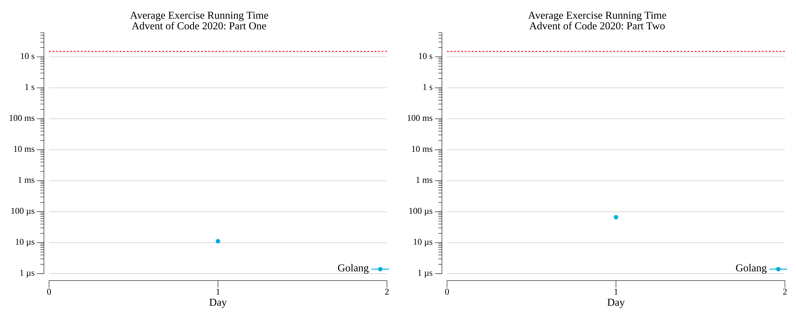

# Advent of Code: 2020

[Advent of Code 2020](https://adventofcode.com/2020) exercise solutions.

<!-- ★ ☆ -->

| Exercise                     | Stars | Solutions  |
|------------------------------|:-----:|------------|
| [Day 1: Report Repair][rm_1] |  ★ ★  | [Go][go_1] |
| 2                            |  ☆ ☆  |            |
| 3                            |  ☆ ☆  |            |
| 4                            |  ☆ ☆  |            |
| 5                            |  ☆ ☆  |            |
| 6                            |  ☆ ☆  |            |
| 7                            |  ☆ ☆  |            |
| 8                            |  ☆ ☆  |            |
| 9                            |  ☆ ☆  |            |
| 10                           |  ☆ ☆  |            |
| 11                           |  ☆ ☆  |            |
| 12                           |  ☆ ☆  |            |
| 13                           |  ☆ ☆  |            |
| 14                           |  ☆ ☆  |            |
| 15                           |  ☆ ☆  |            |
| 16                           |  ☆ ☆  |            |
| 17                           |  ☆ ☆  |            |
| 18                           |  ☆ ☆  |            |
| 19                           |  ☆ ☆  |            |
| 20                           |  ☆ ☆  |            |
| 21                           |  ☆ ☆  |            |
| 22                           |  ☆ ☆  |            |
| 23                           |  ☆ ☆  |            |
| 24                           |  ☆ ☆  |            |
| 25                           |  ☆ ☆  |            |

[rm_1]: 01-reportRepair/README.md
[go_1]: 01-reportRepair/go

## 2020 Run Times



## 2020 Personal Leaderboard

```text

```
