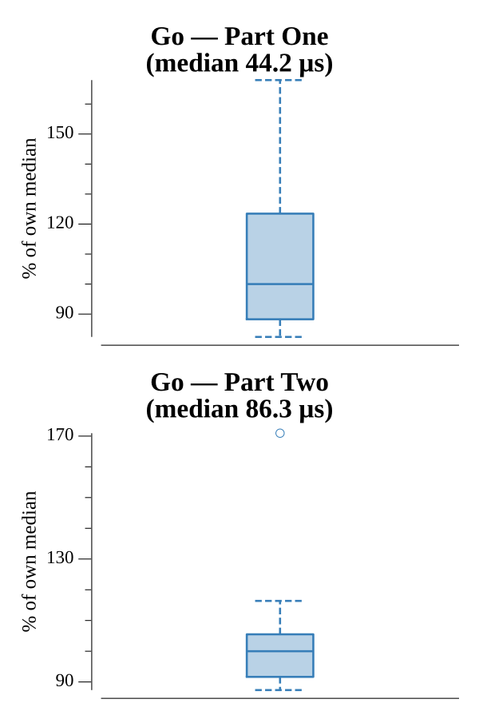

# [Day 3: Binary Diagnostic](https://adventofcode.com/2021/day/3)

<!-- These are helper text to make formatting the yearly readme consistent and easier...

[Day 3: Binary Diagnostic][rm3]
[Go][go3]

[rm3]: 03-binaryDiagnostic/README.md
[go3]: 03-binaryDiagnostic/go

-->

## Notes

Part One builds gamma from the most-common bit in each column; epsilon is just
gamma's bitwise complement over the fixed width, so a single pass of majority
counts gives both. Part Two filters the list one column at a time — keeping the
most-common bit for the oxygen rating (ties → 1) and the least-common for the CO₂
rating (ties → 0) — until a single number remains in each.

## Go

```text
────────────────────────────────────────
─    2021 Day 3: Binary Diagnostic     ─
────────────────────────────────────────

Solving (Go)…
1.0:  PASS            54.505µs
2.0:  PASS           110.593µs
```

## Visualization

The part-two oxygen filter as a sequence of panels laid left to right. The first
panel is the full diagnostic report; each following panel is the shrinking set of
candidates that still match the most-common bit in the current column (tinted
gold), so the funnel narrowing a thousand numbers down to one reads as a
staircase across the image.


## Run Times


