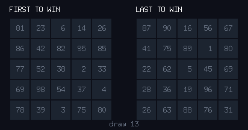
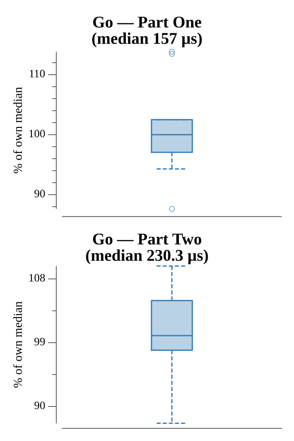

# [Day 4: Giant Squid](https://adventofcode.com/2021/day/4)

<!-- These are helper text to make formatting the yearly readme consistent and easier...

[Day 4: Giant Squid][rm4]
[Go][go4]

[rm4]: 04-giantSquid/README.md
[go4]: 04-giantSquid/go

-->

## Notes

Play bingo: draw numbers in order, marking them on every 5×5 board. A board wins
when a full row or column is marked; its score is the sum of unmarked cells times
the number just drawn. Marking checks only the affected cell's row and column
rather than rescanning the board. Part One is the first board to win; Part Two
keeps drawing (skipping boards that have already won) and reports the last one.

## Go

```text
────────────────────────────────────────
─       2021 Day 4: Giant Squid        ─
────────────────────────────────────────

Solving (Go)…
1.0:  PASS           156.691µs
2.0:  PASS           211.074µs
```

## Visualization

The two decisive boards animated side by side (GIF), one frame per drawn number:
the first board to win (left) and the last to win (right). Cells light green as
they are marked, the current draw flashes red, and when a board completes its
winning row or column flashes gold. The left board wins early and freezes while
the right keeps filling — marked but still losing — until it finally completes.



## Run Times


