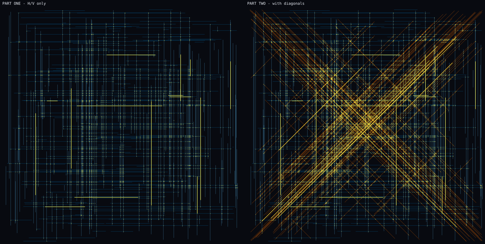
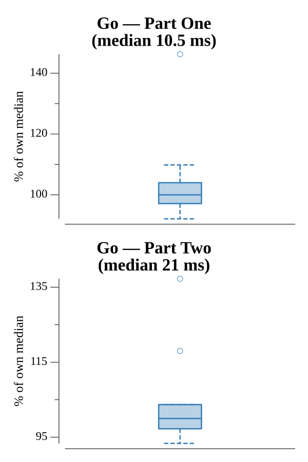

# [Day 5: Hydrothermal Venture](https://adventofcode.com/2021/day/5)

<!-- These are helper text to make formatting the yearly readme consistent and easier...

[Day 5: Hydrothermal Venture][rm5]
[Go][go5]

[rm5]: 05-hydrothermalVenture/README.md
[go5]: 05-hydrothermalVenture/go

-->

## Notes

Rasterize each vent line into a coverage grid and count cells hit by two or more
lines. Because every segment is horizontal, vertical, or exactly 45° diagonal,
one stepping loop covers all cases: step by `sign(dx)`/`sign(dy)` for
`max(|dx|,|dy|)` steps. Part One skips the diagonals; Part Two includes them.

## Go

```text
────────────────────────────────────────
─   2021 Day 5: Hydrothermal Venture   ─
────────────────────────────────────────

Solving (Go)…
1.0:  PASS            10.623ms
2.0:  PASS            27.206ms
```

## Visualization

The vent field as an SVG with two panels: part one (horizontal and vertical
lines only, left) and part two (diagonals added, right). Lines are colored by
orientation from a colorblind-safe palette — horizontal blue, vertical sky
blue, diagonal vermilion — and every danger cell where two or more vents cross
(the cells each part counts) is marked with a bright yellow dot. The orientation
colors also differ in brightness, so the encoding survives grayscale. Splitting
the parts makes the extra crossings the diagonals introduce obvious, and SVG
keeps the thousands of thin lines crisp at any zoom.



## Run Times


