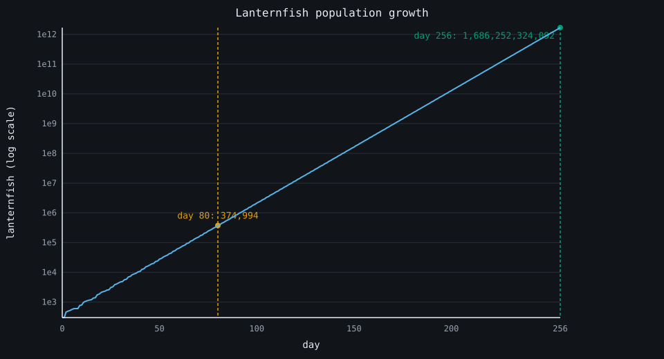
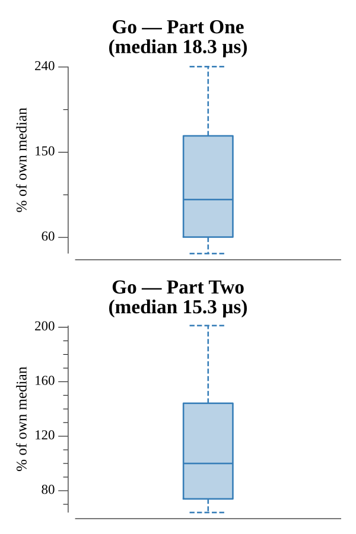

# [Day 6: Lanternfish](https://adventofcode.com/2021/day/6)

<!-- These are helper text to make formatting the yearly readme consistent and easier...

[Day 6: Lanternfish][rm6]
[Go][go6]

[rm6]: 06-lanternfish/README.md
[go6]: 06-lanternfish/go

-->

## Notes

The population grows exponentially, so simulating individual fish is hopeless by
Part Two (256 days). Instead track a histogram of counts per timer value (0..8):
each day the fish at timer 0 both reset to 6 and spawn newborns at 8, and every
other bucket shifts down one. That is O(days × 9) regardless of population, so
both parts are the same code with a different day count.

## Go

```text
────────────────────────────────────────
─       2021 Day 6: Lanternfish        ─
────────────────────────────────────────

Solving (Go)…
1.0:  PASS            12.335µs
2.0:  PASS            11.110µs
```

## Visualization

The total population over the full 256 days as an SVG line chart on a log scale —
the only way the growth fits on one page. The near-straight line confirms the
exponential; the small wobble near the origin is the 7-day spawning cycle before
it smooths out. Markers call out day 80 (part one) and day 256 (part two). The
encoding is position-based, so it reads fine in grayscale.



## Run Times


