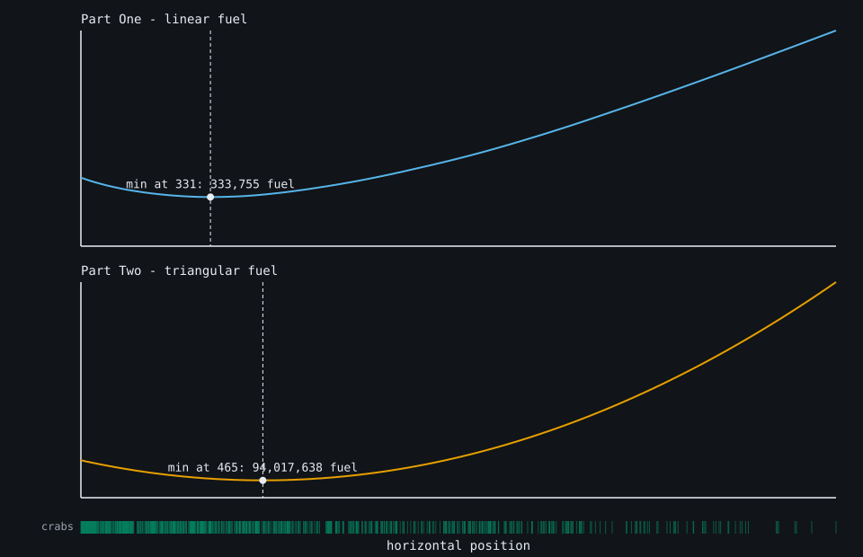
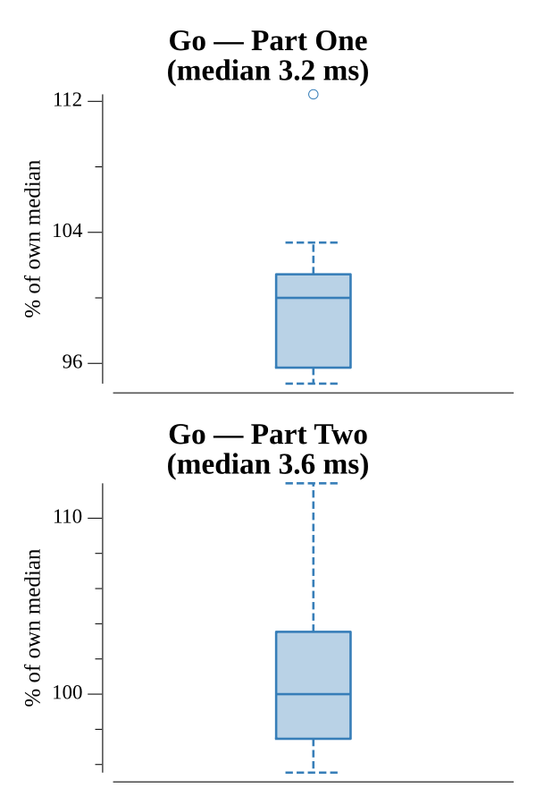

# [Day 7: The Treachery of Whales](https://adventofcode.com/2021/day/7)

<!-- These are helper text to make formatting the yearly readme consistent and easier...

[Day 7: The Treachery of Whales][rm7]
[Go][go7]

[rm7]: 07-theTreacheryOfWhales/README.md
[go7]: 07-theTreacheryOfWhales/go

-->

## Notes

Find the alignment position that costs the least total fuel. Rather than reason
about closed-form optima (median for part one, near the mean for part two), the
solver just sweeps every candidate position across the range and takes the
minimum — the range is only ~2000 wide, so it is instant and sidesteps rounding
and parity edge cases. Part One uses linear fuel (distance `d`); Part Two uses
triangular fuel (`d(d+1)/2`), plugged in as the cost function.

## Go

```text
────────────────────────────────────────
─ 2021 Day 7: The Treachery of Whales  ─
────────────────────────────────────────

Solving (Go)…
1.0:  PASS             3.791ms
2.0:  PASS             3.760ms
```

## Visualization

Total fuel cost against every candidate alignment position, one panel per part
over a shared x-axis (SVG). Part One's linear cost is a piecewise-linear "V"
minimized at the median; Part Two's triangular cost is a smooth parabola
minimized near the mean. Each panel marks its minimum (the answer), and a tick
row shows where the crabs actually sit — their left-skewed distribution is why
the two minima land at different positions.



## Run Times


