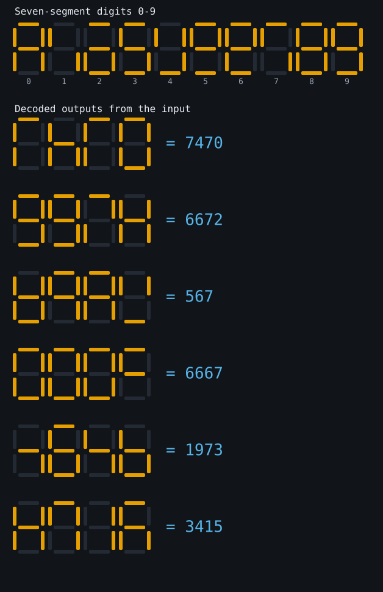
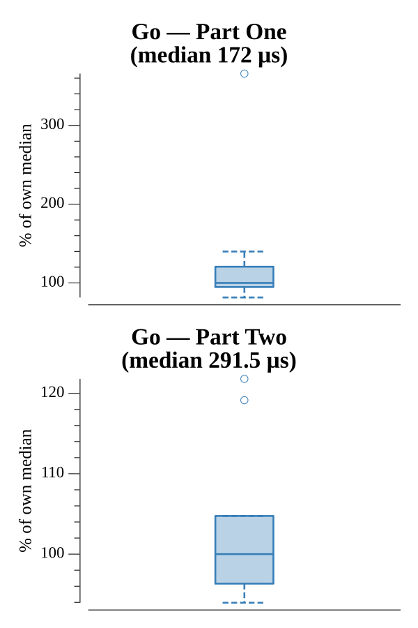

# [Day 8: Seven Segment Search](https://adventofcode.com/2021/day/8)

<!-- These are helper text to make formatting the yearly readme consistent and easier...

[Day 8: Seven Segment Search][rm8]
[Go][go8]

[rm8]: 08-sevenSegmentSearch/README.md
[go8]: 08-sevenSegmentSearch/go

-->

## Notes

Each pattern is stored as a 7-bit segment mask, which turns "contains" tests into
bitwise AND. Part One just counts output digits with the four unique segment
counts (1, 4, 7, 8). Part Two deduces the scrambling per line from segment
overlap: 1/4/7/8 are fixed by length, then among the six-segment digits 9
contains 4 and 0 contains 1 (6 is the rest), and among the five-segment digits 3
contains 1 and 5 is a subset of 6 (2 is the rest). No permutation search needed.

## Go

```text
────────────────────────────────────────
─   2021 Day 8: Seven Segment Search   ─
────────────────────────────────────────

Solving (Go)…
1.0:  PASS           161.871µs
2.0:  PASS           314.531µs
```

## Visualization

The puzzle's actual subject drawn as SVG seven-segment displays: a reference row
of the ten digit glyphs 0-9, then several entries from the input decoded and
their four-digit outputs shown as lit displays with the numeric value beside
each. Lit segments are amber, unlit segments faint outlines, so the digits read
by shape and brightness (fine in grayscale).



## Run Times


