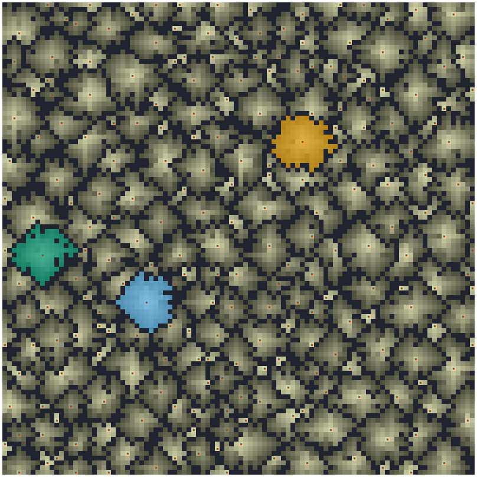
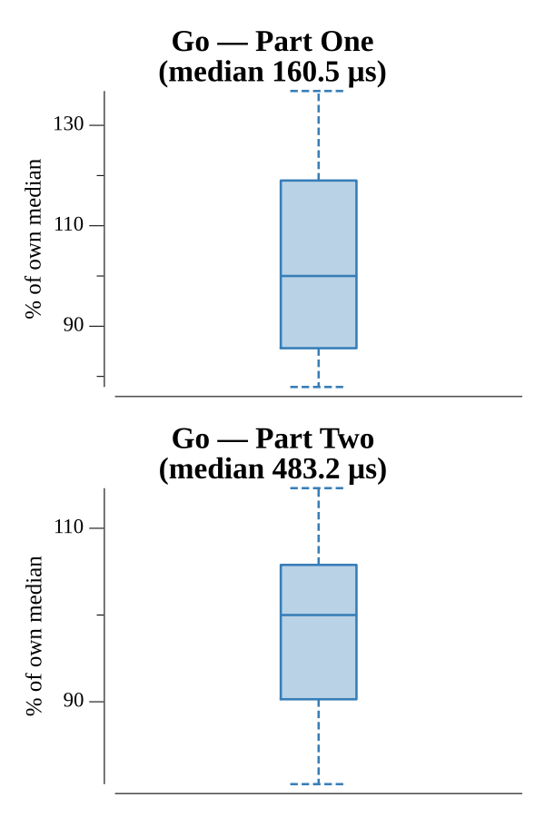

# [Day 9: Smoke Basin](https://adventofcode.com/2021/day/9)

<!-- These are helper text to make formatting the yearly readme consistent and easier...

[Day 9: Smoke Basin][rm9]
[Go][go9]

[rm9]: 09-smokeBasin/README.md
[go9]: 09-smokeBasin/go

-->

## Notes

Part One scans for low points (cells lower than every orthogonal neighbor) and
sums their `1 + height` risk. Part Two sizes the basins: since height-9 cells are
walls and every other cell belongs to exactly one basin, a single flood-fill over
all non-9 connected components gives every basin size directly — no need to grow
outward from each low point. The three largest sizes are multiplied.

## Go

```text
────────────────────────────────────────
─       2021 Day 9: Smoke Basin        ─
────────────────────────────────────────

Solving (Go)…
1.0:  PASS           175.187µs
2.0:  PASS           551.657µs
```

## Visualization

The heightmap as a PNG. Height-9 ridge lines are drawn as dark walls so the basin
network reads as light pools separated by dark ridges, with brighter meaning
deeper (lower) ground. The three largest basins — the ones Part Two multiplies —
are flooded with distinct colorblind-safe accents, and every low point (Part One)
is marked. Height is encoded by brightness, so the relief still reads in grayscale.



## Run Times


