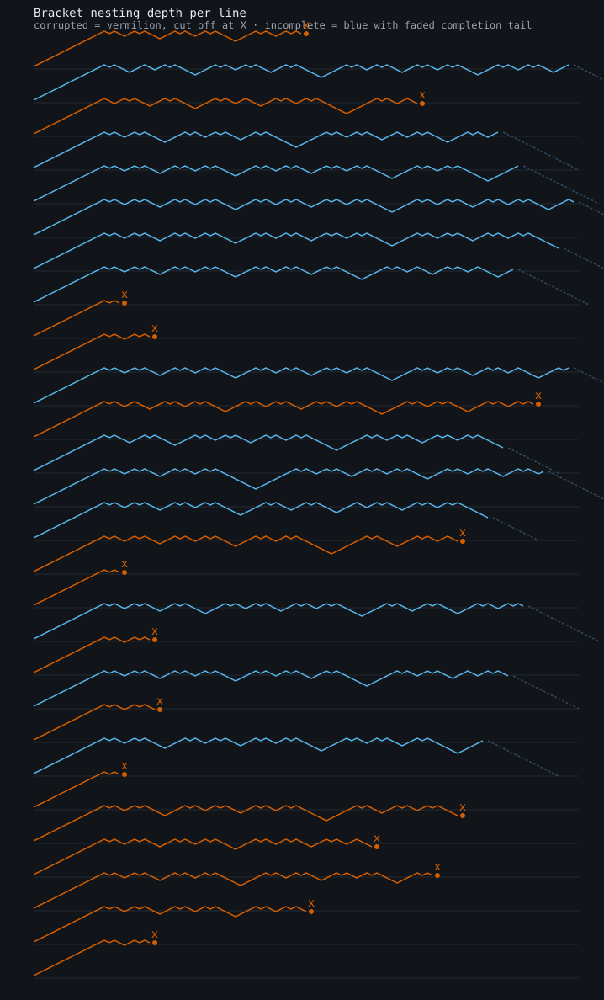
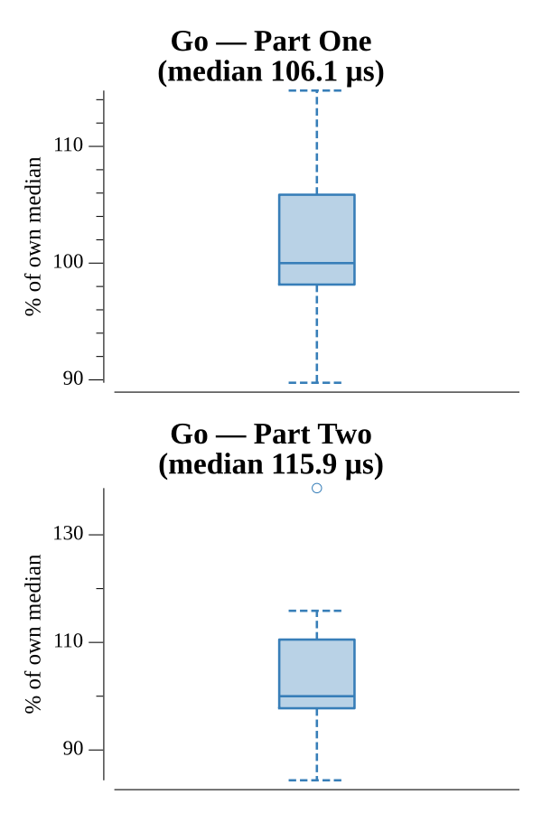

# [Day 10: Syntax Scoring](https://adventofcode.com/2021/day/10)

<!-- These are helper text to make formatting the yearly readme consistent and easier...

[Day 10: Syntax Scoring][rm10]
[Go][go10]

[rm10]: 10-syntaxScoring/README.md
[go10]: 10-syntaxScoring/go

-->

## Notes

One stack pass classifies each line. Push the expected closer on every opener; on
a closing bracket, a mismatch with the top of the stack means the line is
corrupted (record its error score and stop). A line that finishes without a
mismatch is incomplete — the leftover stack, innermost first, is exactly the
completion string. Part One sums corrupted error scores; Part Two scores each
completion and takes the median (guaranteed odd count).

## Go

```text
────────────────────────────────────────
─     2021 Day 10: Syntax Scoring      ─
────────────────────────────────────────

Solving (Go)…
1.0:  PASS           116.148µs
2.0:  PASS           140.244µs
```

## Visualization

Each navigation line drawn as a nesting-depth profile (SVG), a sample stacked
vertically. Corrupted lines (Part One) are vermilion and cut off at the offending
bracket, marked with an X; incomplete lines (Part Two) are blue and run their full
length, then a faded dashed tail descends back to the baseline showing the
completion needed to close them. Status reads by marker and shape as well as
color, so it survives grayscale.



## Run Times


