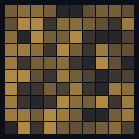
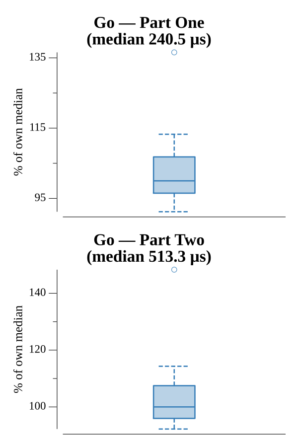

# [Day 11: Dumbo Octopus](https://adventofcode.com/2021/day/11)

<!-- These are helper text to make formatting the yearly readme consistent and easier...

[Day 11: Dumbo Octopus][rm11]
[Go][go11]

[rm11]: 11-dumboOctopus/README.md
[go11]: 11-dumboOctopus/go

-->

## Notes

Each step charges every octopus by one; any over 9 flashes, bumping all eight
neighbors, which can cascade. A work queue drives the cascade: seed it with the
cells that cross the threshold, and push neighbors as they first exceed 9 (a
per-step `flashed` guard prevents double-counting). Flashed octopuses reset to 0.
Part One totals flashes over 100 steps; Part Two runs until a step flashes all
100 at once.

## Go

```text
────────────────────────────────────────
─      2021 Day 11: Dumbo Octopus      ─
────────────────────────────────────────

Solving (Go)…
1.0:  PASS           303.794µs
2.0:  PASS           518.042µs
```

## Visualization

The grid animated step by step (GIF). Each octopus is shaded by energy on a
dark-to-bright ramp, and one that just flashed is drawn white, so the cascade
ripples stand out. The animation runs to the first step where every octopus
flashes at once — the part-two answer — and holds on that fully-white
synchronized frame. Energy is encoded by brightness, so it reads in grayscale.



## Run Times


