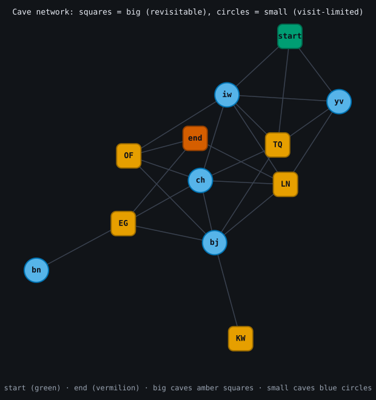
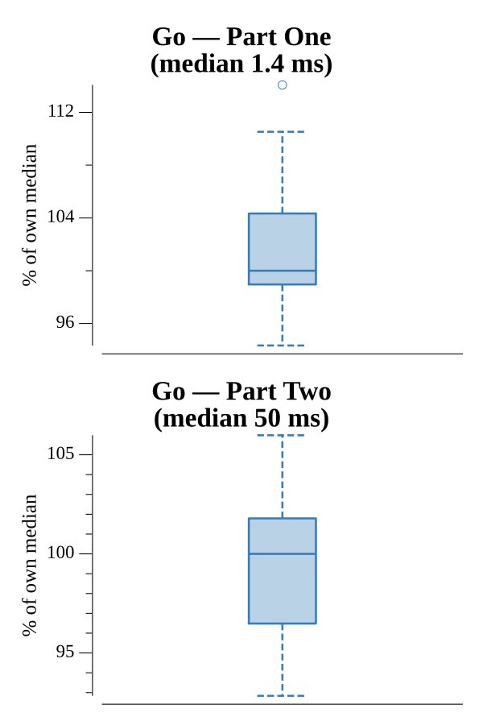

# [Day 12: Passage Pathing](https://adventofcode.com/2021/day/12)

<!-- These are helper text to make formatting the yearly readme consistent and easier...

[Day 12: Passage Pathing][rm12]
[Go][go12]

[rm12]: 12-passagePathing/README.md
[go12]: 12-passagePathing/go

-->

## Notes

Count `start`-to-`end` paths with a backtracking DFS. Big caves (uppercase) are
never restricted; small caves (lowercase) are visit-limited. The only difference
between the parts is the revisit rule, so the traversal carries a `canDouble`
flag: Part One passes `false` (small caves at most once); Part Two passes `true`,
letting one small cave be visited twice by spending that budget. `start` is never
re-entered.

## Go

```text
────────────────────────────────────────
─     2021 Day 12: Passage Pathing     ─
────────────────────────────────────────

Solving (Go)…
1.0:  PASS             2.373ms
2.0:  PASS            54.611ms
```

## Visualization

The cave network as an SVG graph, laid out with a small force-directed
simulation. Big caves (revisitable) are drawn as squares and small caves
(visit-limited) as circles, so the cave type — the very rule that separates the
two parts — reads by shape as well as color; `start` and `end` are highlighted.
Because the type is encoded by shape, the graph stays clear in grayscale.



## Run Times


