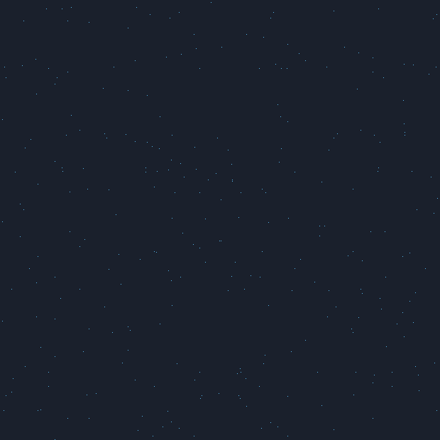
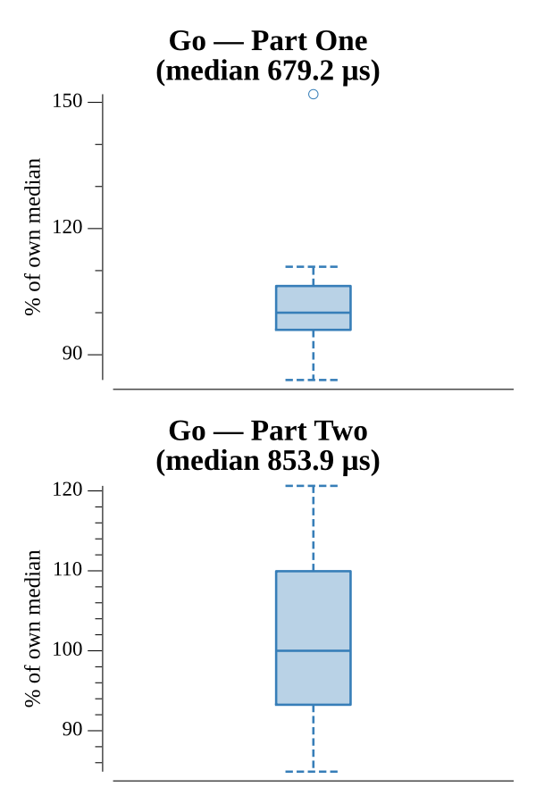

# [Day 13: Transparent Origami](https://adventofcode.com/2021/day/13)

<!-- These are helper text to make formatting the yearly readme consistent and easier...

[Day 13: Transparent Origami][rm13]
[Go][go13]

[rm13]: 13-transparentOrigami/README.md
[go13]: 13-transparentOrigami/go

-->

## Notes

A fold is a coordinate reflection: folding along `y=f` maps any dot with `y > f`
to `2f - y` (and likewise for `x=f`). Applying a fold is one pass over the dot
set, deduplicating via a map. Part One reports the dot count after the first
fold; Part Two applies all folds and renders the remaining dots as ASCII art —
they spell eight capital letters, which is the answer.

## Go

```text
────────────────────────────────────────
─   2021 Day 13: Transparent Origami   ─
────────────────────────────────────────

Solving (Go)…
1.0:  PASS           670.579µs
2.0:  PASS           861.998µs
```

## Visualization

The folding animated (GIF). The first frame is the full sheet of scattered dots;
each subsequent frame applies one more fold, so the paper visibly halves again
and again until the dots line up into the eight-letter message (highlighted
yellow on the final frame). Dots, sheet, and background are distinguished by
brightness, so it reads in grayscale.



## Run Times


