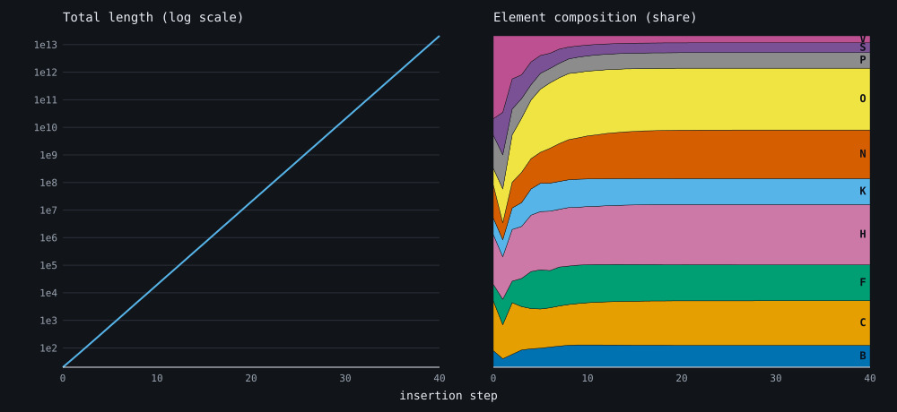
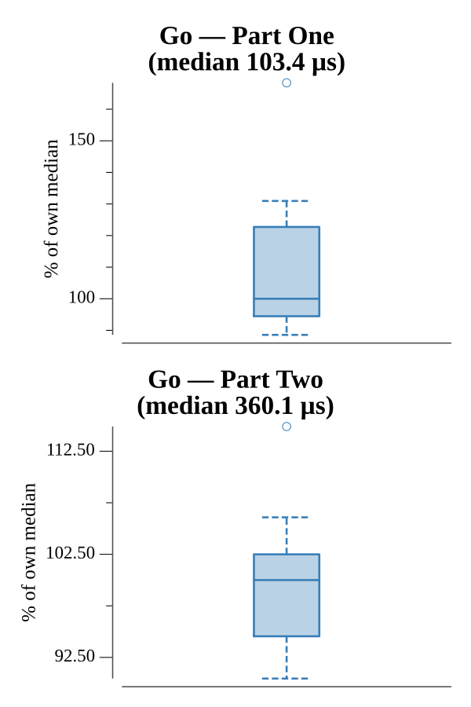

# [Day 14: Extended Polymerization](https://adventofcode.com/2021/day/14)

<!-- These are helper text to make formatting the yearly readme consistent and easier...

[Day 14: Extended Polymerization][rm14]
[Go][go14]

[rm14]: 14-extendedPolymerization/README.md
[go14]: 14-extendedPolymerization/go

-->

## Notes

The polymer doubles in length every step, so by step 40 it is far too long to
build. Instead track counts of adjacent pairs: a pair `AB` with rule `AB -> C`
becomes `AC` and `CB`, so their counts carry forward. Element frequencies come
from counting the first character of every pair (plus the template's fixed last
character). Both parts are the same loop — 10 steps for Part One, 40 for Part Two
— and the answer is most-common minus least-common element count.

## Go

```text
────────────────────────────────────────
─ 2021 Day 14: Extended Polymerization ─
────────────────────────────────────────

Solving (Go)…
1.0:  PASS            92.240µs
2.0:  PASS           334.328µs
```

## Visualization

Two SVG panels over the 40 insertion steps. The left plots total length on a log
scale — a straight line, confirming the exponential growth that rules out
building the string. The right is a normalized stacked band chart of each
element's share, showing the composition churn early then settle into a steady
mix even as the total explodes. Every band is labeled with its element letter, so
it reads without relying on color.



## Run Times


