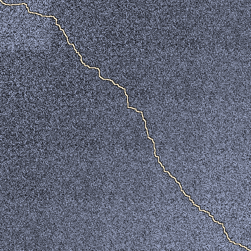
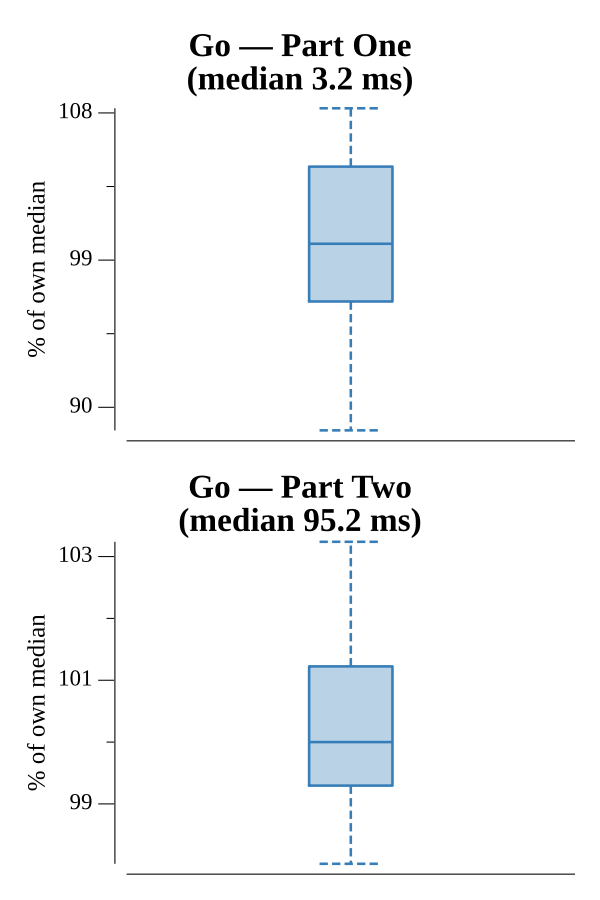

# [Day 15: Chiton](https://adventofcode.com/2021/day/15)

<!-- These are helper text to make formatting the yearly readme consistent and easier...

[Day 15: Chiton][rm15]
[Go][go15]

[rm15]: 15-chiton/README.md
[go15]: 15-chiton/go

-->

## Notes

Lowest-total-risk path from the top-left to the bottom-right with non-negative
weights — Dijkstra with a `container/heap` priority queue. Part One runs on the
given grid. Part Two tiles it 5×5, where a cell in tile `(tr, tc)` has risk
`(orig + tr + tc - 1) % 9 + 1` (the `-1`/`+1` keeps the wrap in 1–9); the same
Dijkstra then runs on the 500×500 expanded grid.

## Go

```text
────────────────────────────────────────
─         2021 Day 15: Chiton          ─
────────────────────────────────────────

Solving (Go)…
1.0:  PASS             4.058ms
2.0:  PASS           101.150ms
```

## Visualization

The full part-two 5×5-expanded risk grid as a PNG, with the lowest-risk path
traced across it. Risk is a dark-to-bright relief (low risk dark, high risk
bright); the optimal path is drawn as a bright line with a dark outline so it
stays distinct against the field at any local brightness — visibly winding to
seek out low-risk cells rather than running straight. Risk is brightness-encoded
and the outlined path survives grayscale.



## Run Times


