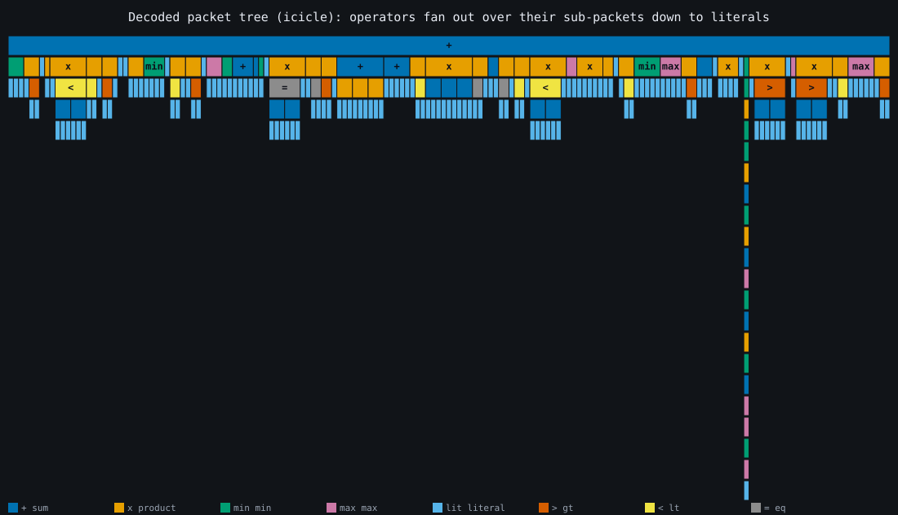
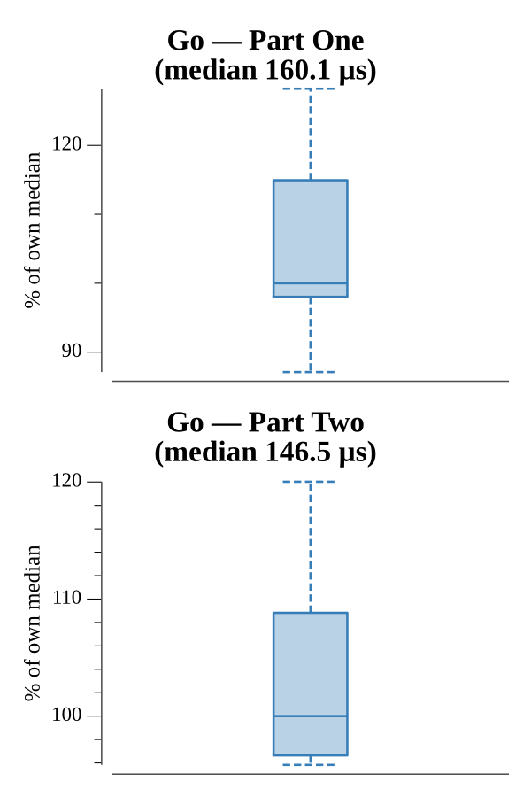

# [Day 16: Packet Decoder](https://adventofcode.com/2021/day/16)

<!-- These are helper text to make formatting the yearly readme consistent and easier...

[Day 16: Packet Decoder][rm16]
[Go][go16]

[rm16]: 16-packetDecoder/README.md
[go16]: 16-packetDecoder/go

-->

## Notes

Expand the hex to a bit string, then recursively descend it with a cursor: read
the 3-bit version and type, then either a literal (5-bit groups) or an operator
whose sub-packets are delimited by a 15-bit total length or an 11-bit count. One
parse builds a packet tree; Part One sums versions over the tree and Part Two
evaluates it (type ids: 0 sum, 1 product, 2 min, 3 max, 4 literal, 5 `>`, 6 `<`,
7 `=`).

## Go

```text
────────────────────────────────────────
─     2021 Day 16: Packet Decoder      ─
────────────────────────────────────────

Solving (Go)…
1.0:  PASS           243.623µs
2.0:  PASS           154.580µs
```

## Visualization

The decoded packet tree as an icicle diagram (SVG). Depth runs top to bottom: the
root operator spans the full width and each child takes a slice proportional to
the literals beneath it, down to the leaf values. Packets are colored by type and
labeled with an operator glyph (`+`, `x`, `min`, `max`, `>`, `<`, `=`, or `lit`),
so the type reads from the symbol as well as the color — the one deep chain on the
right is the transmission's most nested branch. Both answers are walks of this tree.



## Run Times


