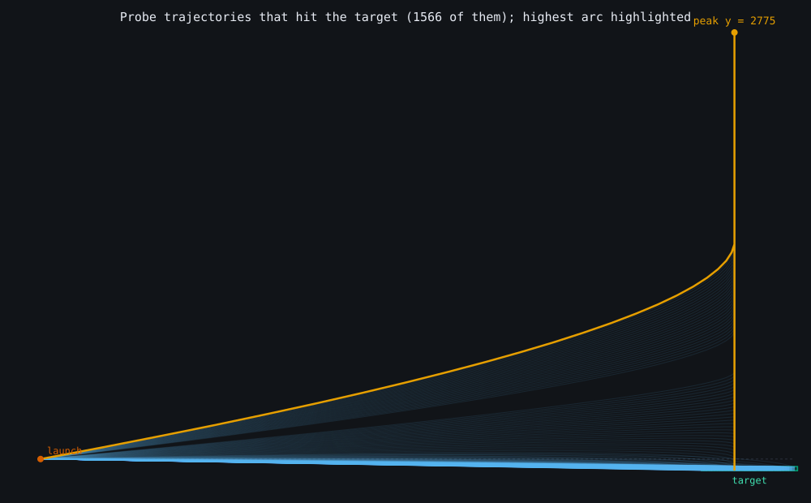
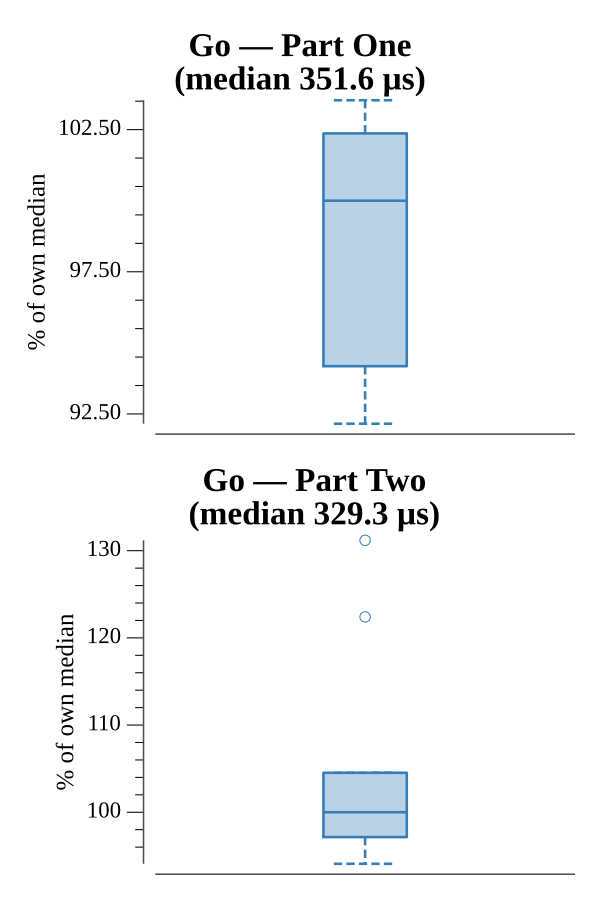

# [Day 17: Trick Shot](https://adventofcode.com/2021/day/17)

<!-- These are helper text to make formatting the yearly readme consistent and easier...

[Day 17: Trick Shot][rm17]
[Go][go17]

[rm17]: 17-trickShot/README.md
[go17]: 17-trickShot/go

-->

## Notes

Simulate a bounded set of launch velocities. `vx` runs from 1 to the target's far
x edge (any faster overshoots on the first step); `vy` runs from the target's
bottom up to `-yMin` (above that, symmetry means the probe returns to y=0 already
moving too fast to stay in the target). Each shot is stepped with drag on `vx` and
gravity on `vy` until it lands or passes the target. Part One reports the highest
peak among hits; Part Two counts the distinct hitting velocities.

## Go

```text
────────────────────────────────────────
─       2021 Day 17: Trick Shot        ─
────────────────────────────────────────

Solving (Go)…
1.0:  PASS           365.338µs
2.0:  PASS           325.244µs
```

## Visualization

Every launch velocity that lands in the target drawn as a faint arc (SVG), so the
envelope of all winning shots fans out from the launch point to the target box;
the single arc reaching the greatest height (Part One) is highlighted and its peak
labeled. Because the peak height dwarfs the target distance, the axes are scaled
independently to fill the canvas. The highlight reads by brightness, so it stays
distinct in grayscale.



## Run Times


